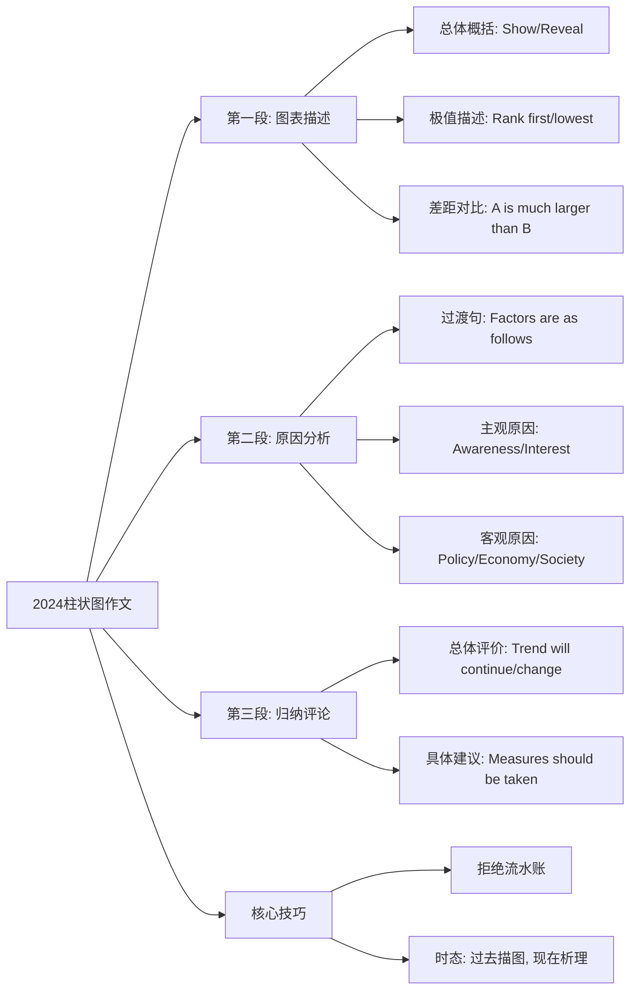

本章节笔记针对 **2024年考研英语（二）大作文（或同类柱状图）** 进行深度拆解。2024年英语二大作文考查的是“某高校学生劳动实践活动调查”，属于典型的 **静态柱状图（Static Bar Chart）**。

此类图表的核心在于：**“不仅要会看图说话，更要会挖掘数据背后的社会/个人动因。”**

---

### 第一部分：核心定义（基础地基）

柱状图（Bar Chart）是考研英语二最核心的考查形式，本质是将数据的 **对比（Comparison）** 或 **变化（Change）** 可视化。

*   **核心逻辑公式（三段论）：**
    $$ \text{Essay} = \text{Data Description (30\%)} + \text{Causal Analysis (50\%)} + \text{Comment/Prediction (20\%)} $$

*   **静态图 vs. 动态图（Crucial Distinction）：**
    *   **静态图（Static）：** 侧重同一时间点不同对象的 *对比*（如2024年真题，对比不同劳动活动的参与度）。
    *   **动态图（Dynamic）：** 侧重同一对象随时间的 *变化*（如某产品5年内的销量走势）。
    *   *注意：2024年考题属于**静态对比**，切忌通篇写 "increase/decrease"（增长/下降），而应写 "rank first/occupy the largest proportion"（排名第一/占比最大）。*

*   **数据描述黄金定律：**
    $$ \text{Feature} = \text{Extremum (极值)} + \text{Gap (差距)} + \text{Trend (趋势)} $$

---

### 第二部分：核心考点（考试套路）

针对2024年及未来的柱状图，重点掌握以下三大杀手锏：

#### 考点一：极值与差距描述（Data Description）
*   **原理：** 阅卷人不需要知道所有数据，只需要知道“谁最高”、“谁最低”以及“它们差多少”。
*   **秒杀公式/句型：**
    1.  **极值句：** $A + \text{ranks first with} + \text{percentage}, \text{followed by} + B + \text{at} + \text{percentage}.$
    2.  **差距句：** $\text{The percentage of } A \text{ is much larger/smaller than that of } B.$
*   **应用场景：** 第一段的核心描述，用于点出图表最突出的矛盾点（例如2024年：学习类实践占比极高，体力劳动类占比极低）。

#### 考点二：原因分析框架（Causal Analysis）
*   **原理：** 第二段必须解释“为什么会出现这种数据分布”。对于柱状图，通常采用 **“主观因素 + 客观因素”** 的双盲法分析。
*   **结论/切入点：**
    *   **主观（Internal）：** Awareness (意识), Interest (兴趣), Capability (能力).
    *   **客观（External）：** Policy (政策), Social Atmosphere (社会风气), Technology (技术/便利性).
*   **应用场景：** 第二段主体，解释为什么大家只爱学习不爱劳动（重视程度不同、评价体系导向等）。

#### 考点三：同义词替换（Lexical Variety）
*   **原理：** 拒绝低幼词汇，展示语言多样性。
*   **替换表：**
    *   **占（比例）：** account for $\rightarrow$ constitute / take up / occupy.
    *   **大约：** about $\rightarrow$ approximately / roughly / around.
    *   **表明：** show $\rightarrow$ reveal / indicate / demonstrate.

---

### 第三部分：真题逻辑演练（文字解析）

**【例题 1】2024年英语二真题改编（某高校学生劳动实践活动调查）**
*   **图表数据：**
    *   打扫宿舍 (Cleaning Dorms): 10%
    *   参加志愿者活动 (Volunteering): 25%
    *   参加科研竞赛 (Academic Contests): 65%

**文字解析（Teacher's Logic）：**

1.  **第一步：审题与定调（第一段）**
    *   **观察：** 这是一个静态柱状图。核心矛盾是“脑力劳动（科研）过热，体力劳动（打扫）过冷”。
    *   **落笔：** 开门见山指出图表主题。接着描述数据：先说最高的（Academic Contests, 65%），再说最低的（Cleaning Dorms, 10%），最后用一句总结这种**巨大差异**（sharp contrast）。

2.  **第二步：深挖原因（第二段）**
    *   **逻辑链：** 为什么学生都去搞科研而不愿打扫卫生？
    *   **原因一（利益驱动/客观）：** 在当前的评价体系下，科研竞赛直接关联奖学金和保研（Scholarships and further education），而打扫卫生没有直接收益。
    *   **原因二（意识缺失/主观）：** 许多学生从心理上忽视了基础劳动的重要性（overlook the value of manual labor），认为那是浪费时间。

3.  **第三步：结论与建议（第三段）**
    *   **结论：** 这种现象需要平衡。
    *   **建议：** 学校应加强引导，学生应全面发展。

**【例题 2】职场类柱状图（MEM/MBA 常见预测）**
*   **题目：** 员工选择工作时的考量因素（薪资、发展、通勤）。
*   **数据：** 薪资 (60%)，发展 (30%)，通勤 (10%)。

**文字解析：**

1.  **第一步：描述。** 薪资占比超过半数（more than half），占据主导地位（dominant position）。
2.  **第二步：分析。**
    *   **经济基础：** 生活成本上升（rising cost of living），薪资是生存基础。
    *   **职业规划：** 虽然发展重要，但大多数人优先考虑短期回报（immediate returns）。
3.  **第三步：总结。** 企业应提供有竞争力的薪酬来吸引人才。

---

### 第四部分：避坑指南（考试心理）

**考生最容易犯的 3 个错误：**

1.  **流水账报数（Data Dumping）：**
    *   *错误写法：* A is 10%, B is 20%, C is 30%, D is 40%.
    *   *防坑口诀：* **“抓大放小，合并同类。”** 只写最大和最小，中间的数据如果不起眼，可以略写或归类为“其余选项”。

2.  **时态混乱（Tense Confusion）：**
    *   *错误写法：* 图表是去年的调查，却通篇用一般现在时描述具体的调查动作。
    *   *防坑技巧：* **“图表描述用过去（Surveyed/Did），客观事实用现在（Indicates/Is）。”** 比如：The survey **showed** (past) that... which **indicates** (present) a trend.

3.  **主谓不一致（Subject-Verb Agreement）：**
    *   *错误：* The percentage of students **are** high.
    *   *纠正：* **The percentage** ... **is** ... / **Students** ... **are** ...
    *   *记忆：* 看到 `percentage/proportion` 作主语，动词必用单数 `is/has`。

---

### 第五部分：考情分析（情报局）

*   **难度星级：** ⭐⭐⭐ (逻辑不难，难在语言的地道表达)
*   **考频指数：** ⭐⭐⭐⭐⭐ (柱状图与饼图是英语二的“双子星”，占据70%以上的江山)
*   **命题趋势：**
    1.  **话题“反押题”化：** 不再单纯考“手机成瘾”、“环境污染”，转向更具体的社会切面（如2024年的“劳动教育”、之前的“快递包装”）。
    2.  **注重“失衡”分析：** 题目数据往往呈现巨大的差异（一边倒），强迫考生分析这种“不平衡”背后的社会动因。

---

### 第六部分：思维导图（知识网）

---

### 第七部分：针对 MEM/MBA 的复习建议

MEM/MBA 考生通常是在职人员，时间碎片化，且英语底子可能生疏。建议如下：

1.  **“功能句”模块化记忆（搭积木法）：**
    不要背几十篇范文，而是背 **3组核心句型**：
    *   描述数据的句型（1组）；
    *   引出原因的过渡句（1组）；
    *   结尾的万能建议句（1组）。
    *   *考试时就像搭积木，把关键词填进去即可。*

2.  **死磕“第二段逻辑”：**
    阅卷老师知道你们英语底子有限，但 MEM/MBA 考生更应展现 **“逻辑思维”**。在分析原因时，多用 `Specifically`（具体来说）、`In other words`（换句话说）、`Consequently`（因此）这些逻辑连接词，能极大地提升文章的成熟度，掩盖语法的瑕疵。

3.  **练字（Handwriting）：**
    这绝对是性价比最高的提分手段。每天花 10 分钟抄写一篇作文，保证卷面整洁、字迹清晰。在职考生的卷面往往比较潦草，如果你的工整，直接 **+2分** 印象分。
