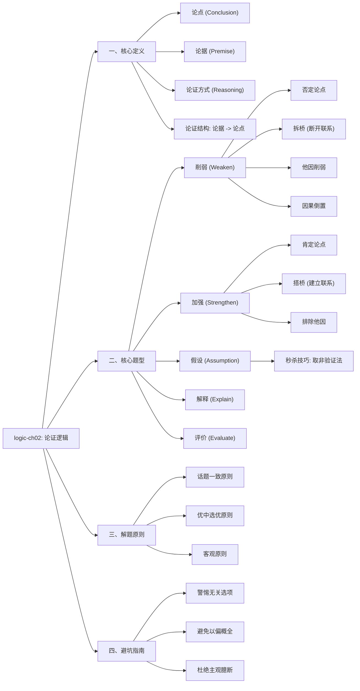

### 第二章：论证逻辑

---

### 第一部分：核心定义（基础地基）

论证逻辑是管理类联考的重中之重，它不考察深奥的逻辑理论，而是检验考生在有限时间内快速理解、分析、判断信息的能力。

*   **论证三要素：** 一个完整的论证由 **论点、论据、论证方式** 构成。
    *   **论点 (Conclusion)：** 论证者所主张并加以辩护的观点。通常由“因此”、“所以”、“认为”等词引导。
    *   **论据 (Premise)：** 用来支撑论点的事实或理由。在解题时，**必须默认题干给出的论据是真实的**，不要用个人常识去质疑。
    *   **论证方式 (Reasoning Process)：** 论据推导至论点的过程，即逻辑链条。这是我们攻击（削弱）或加固（加强）的核心。

*   **基本论证关系式：** 论证的核心结构可以简化为：
    $\text{论据} \xrightarrow{\text{论证方式}} \text{论点}$
    我们的所有操作，无论是削弱、加强还是假设，都是围绕这个箭头所代表的“论证方式”展开的。

*   **核心题型分类：**
    *   **削弱 (Weaken/Undermine)：** 寻找一个选项，使得论点成立的可能性降低。
    *   **加强 (Strengthen/Support)：** 寻找一个选项，使得论点成立的可能性提高。
    *   **假设 (Assumption)：** 寻找一个使得论证成立的 **必要**、但未明说的前提。
    *   **解释 (Explain)：** 寻找一个选项，能最合理地解释题干中看似矛盾的现象。
    *   **评价 (Evaluate)：** 寻找一个选项，其答案的“是”或“否”能对论证的可靠性做出两种截然不同的判断。

---

### 第二部分：核心考点（考试套路）

掌握最高频考点的底层逻辑，是从“凭感觉”到“有方法”的跃迁。

#### 考点一：削弱论证

*   **原理：** 找到论证链条中最脆弱的一环并攻击它，使其断裂或松动。
*   **公式/结论 (削弱强度由高到低)：**
    1.  **否定论点：** 直接指出结论不成立。（较少见，过于直接）
    2.  **拆桥 (断开联系)：** 指出论据和论点之间没有必然的因果联系。这是最常见、最核心的削弱方式。
    3.  **他因削弱：** 提出存在其他原因导致了同样的结果，从而削弱了题干中论据的唯一性或重要性。
    4.  **因果倒置：** 指出题干的因果关系说反了。
*   **应用场景：** 题干中出现“以下哪项最能/最不可能 **削弱/质疑/反驳** 上述论证？”等问法。

#### 考点二：假设论证

*   **原理：** 假设是论证成立的“必要条件”，像桥墩一样，虽然没有明说，但抽掉它，桥（论证）就会塌。
*   **公式/结论 (秒杀技巧)：**
    *   **“取非验证法” (Negation Test)：** 这是检验假设题的黄金法则。
    *   操作步骤：将选项 **取反** (加上“不”或去掉“不”)，带回题干。如果取反后的选项使得 **原论点不成立**，那么该选项就是正确答案。
    *   数学表达：$\text{否定选项} \rightarrow \text{论点不成立} \implies \text{该选项是正确假设}$
*   **应用场景：** 题干中出现“上述论证基于以下哪项 **假设**？”或“……为使上述论证成立，必须补充以下哪项作为 **前提**？”

---

### 第三部分：真题逻辑演练（文字解析）

**【例题 1 - 削弱】**
一项研究发现，经常食用深海鱼油的群体，其心血管疾病的发病率显著低于不食用者。因此，研究人员得出结论：经常食用深海鱼油能够有效预防心血管疾病。
以下哪项如果为真，最能削弱上述结论？
A. 深海鱼油的价格昂贵，一般只有经济条件较好的人才会经常食用。
B. 该研究的样本数量较小，不具有普遍代表性。
C. 深海鱼油中含有丰富的Omega-3脂肪酸，对大脑健康有益。
D. 经常食用深海鱼油的群体，往往也更注重体育锻炼和均衡饮食。

*   **文字解析：**
    1.  **第一步：拆解论证结构。**
        *   论据：经常吃鱼油的人，心血管病发病率低。
        *   论点：吃鱼油能预防心血管病。
        *   论证方式：将“吃鱼油”和“发病率低”这两个同时发生的现象，建立了因果关系。
    2.  **第二步：分析逻辑漏洞。**
        *   典型的“相关不等于因果”谬误。A和B同时发生，不代表A导致了B。可能存在一个第三方因素C，同时导致了A和B。
    3.  **第三步：甄别选项，寻找“他因”。**
        *   A选项讨论价格和经济条件，与疾病预防的直接关系较弱。
        *   B选项质疑样本数量，属于一种削弱方式，但不够直接。
        *   C选项说对大脑有益，是无关项，甚至有轻微加强作用。
        *   D选项完美地提供了“他因”。它指出，这个群体之所以健康，可能是因为他们同时注重锻炼和饮食，而不是因为吃鱼油。这就直接挑战了“鱼油是原因”这一结论。因此，D是最佳的“他因削弱”。

**【例题 2 - 假设】**
某公司计划在所有办公区域安装先进的空气净化器，以减少空气中的污染物，从而提高员工的工作效率。
为使上述计划达到预期效果，最可能基于下列哪项假设？
A. 空气净化器的运行成本在公司预算范围内。
B. 空气质量是影响员工工作效率的唯一因素。
C. 现有办公区域的空气污染物浓度超过了健康标准。
D. 员工工作效率的下降确实是由空气质量不佳导致的。

*   **文字解析：**
    1.  **第一步：拆解论证结构。**
        *   论据（措施）：安装空气净化器，减少污染物。
        *   论点（目的）：提高员工工作效率。
        *   论证方式：通过改善空气质量这一手段，来实现提高效率的目的。
    2.  **第二步：分析逻辑漏洞。**
        *   论证链条存在一个跳跃：从“空气变好”直接跳到了“效率提高”。这中间缺失了一个关键的连接：即“当前的效率低”和“空气不好”之间存在因果关系。如果两者无关，那么净化空气就毫无意义。
    3.  **第三步：使用“取非验证法”检验选项。**
        *   A取非：运行成本超出预算。这会导致计划无法实施，但与计划的“效果”无关。
        *   B取非：空气质量 **不是** 影响效率的 **唯一** 因素。这很正常，不影响空气质量是 *其中一个* 因素的可能性，所以原论点仍然可能成立。
        *   C取非：污染物浓度 **没有** 超过健康标准。即使没超标，也可能存在影响效率的轻微污染，所以原论点仍可能成立。
        *   D取非：员工效率下降 **不是** 由空气质量不佳导致的。如果效率下降的罪魁祸首不是空气，那么你把空气净化得再好，效率也不会因此提高。原论点瞬间崩溃。因此，D是必须成立的假设。

---

### 第四部分：避坑指南（考试心理）

1.  **混淆“无关”与“削弱”。**
    *   **错误表现：** 看到一个选项似乎在唱反调，就认为是削弱。
    *   **防坑口诀：** “话题无关，一概不选；看似削弱，实则无关”。选项必须与题干的论点和论据核心概念紧密相关。

2.  **误把“部分”当“全部”。**
    *   **错误表现：** 题干讨论的是一个普遍性结论，但选项用一个特例来反驳，这种削弱力度很弱。
    *   **防坑口诀：** “以偏概全，力度最浅；要想削弱，直击要害”。要寻找能从根本上动摇论证的选项。

3.  **陷入个人主观判断。**
    *   **错误表现：** “我觉得这个选项说得很有道理”，而不是“这个选项在逻辑上能削弱/加强题干”。
    *   **防坑口诀：** “就题论题，拒绝脑补；你是法官，不是编剧”。严格依据题干给出的信息进行推理。

---

### 第五部分：考情分析（情报局）

*   **难度星级：** ⭐⭐⭐⭐
*   **考频指数：** ⭐⭐⭐⭐⭐
*   **命题趋势：**
    *   **材料长、信息杂：** 近年来，论证题的题干越来越长， spesso 夹杂着数据、背景信息等，考验考生快速筛选核心论证结构的能力。
    *   **场景化、接地气：** 题目内容更多结合时下的商业、科技、社会热点，包装得更像一篇微型阅读理解。
    *   **削弱、加强仍是主流：** 尽管题型多样，但削弱和加强题占据了论证逻辑的半壁江山，是备考的重中之重。

---

### 第六部分：思维导图（知识网）

---

### 第七部分：针对 MEM/MBA 的复习建议

对于时间宝贵的在职考生，论证逻辑的复习必须讲求效率和策略。

1.  **放弃题海战术，聚焦真题精析。**
    与其做上千道模拟题，不如把近10年真题中的每一道论证题都吃透。不仅要明白为什么选对，更要深刻理解每个错误选项为什么错，错在哪里（是无关、是削弱力度不够，还是偷换概念）。

2.  **刻意练习“结构化阅读”。**
    拿到一道题，不要急着读完，而是强迫自己用笔标出“论据”、“论点”和“结论词”。养成在30秒内识别论证结构的好习惯，这是快速解题的生命线。

3.  **建立个人“错题逻辑库”。**
    准备一个错题本，但不要只抄题目和答案。关键是写下“我当时是怎么想的”和“正确的逻辑链条是怎样的”。通过对比思维路径的差异，才能真正纠正错误的思维定势。
