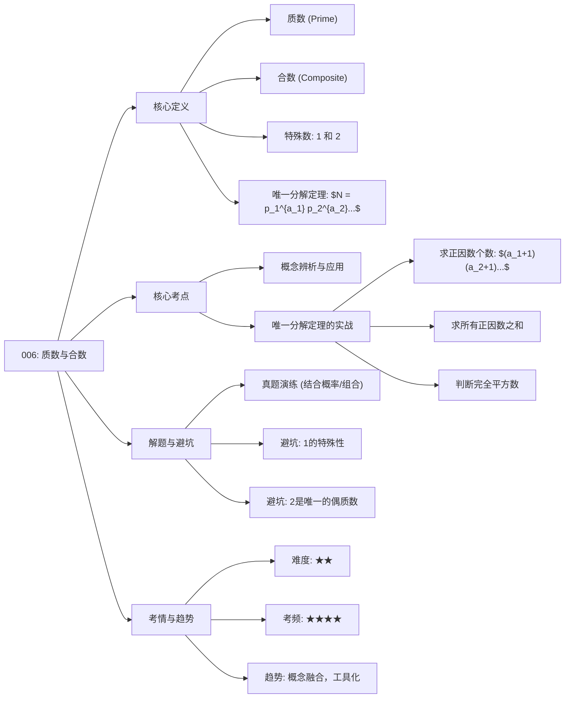

# 006 - 质数与合数

### 第一部分：核心定义（基础地基）

*   **整数 (Integer):** 正整数、负整数和零的统称。管理类联考数学主要考察 **正整数** 的相关性质。
*   **因数与倍数 (Factor and Multiple):** 如果整数 $a$ 能被整数 $b$ 整除，那么 $a$ 就是 $b$ 的倍数，$b$ 就是 $a$ 的因数。例如，$10 = 2 \times 5$，2 和 5 都是 10 的因数。
*   **质数 (Prime Number):** 又称素数。一个大于 1 的自然数，除了 1 和它本身以外不再有其他因数。 例如，2, 3, 5, 7, 11...
*   **合数 (Composite Number):** 一个大于 1 的自然数，除了 1 和它本身以外还有别的因数。 例如，4, 6, 8, 9, 10...
*   **特殊数字：**
    *   **1:** *既不是质数也不是合数*。
    *   **2:** *是最小的质数，也是唯一的偶质数*。
*   **唯一分解定理 (Fundamental Theorem of Arithmetic):** 任何一个大于 1 的自然数，都可以唯一地分解成有限个质数的乘积。这个定理是解决很多数论问题的基石。
    *   公式表达: $N = p_1^{a_1} p_2^{a_2} \cdots p_k^{a_k}$，其中 $p_i$ 是不同的质数，$a_i$ 是正整数。

### 第二部分：核心考点（考试套路）

#### 考点 1：质数与合数的概念辨析

*   **原理：** 直接考察考生对质数、合数定义的理解，特别是对 “1” 和 “2” 的特殊性的掌握。
*   **结论：**
    *   最小的质数是 2。
    *   最小的合数是 4。
    *   连续的自然数中，质数的分布没有固定规律，但连续的两个自然数 (n, n+1) 中，如果 n > 1，必然只有一个是质数 (即数字 2 和 3 的情况) 或者都不是质数。
*   **应用场景：** 主要出现在选择题中，作为题目条件的一部分，或者直接判断一个数的属性。例如，“三个连续的质数”、“两个不同的偶质数” 等表述都暗含着具体的数字。

#### 考点 2：唯一分解定理的应用

*   **原理：** 将一个合数分解成质因数乘积的形式，进而分析其因数的个数、所有因数之和等问题。
*   **公式/结论：**
    *   **正因数个数：** 若 $N = p_1^{a_1} p_2^{a_2} \cdots p_k^{a_k}$，则其正因数的个数为 $(a_1+1)(a_2+1)\cdots(a_k+1)$。
    *   **所有正因数之和：** $(1+p_1+\cdots+p_1^{a_1})(1+p_2+\cdots+p_2^{a_2})\cdots(1+p_k+\cdots+p_k^{a_k})$。
*   **应用场景：** 求解一个数的因数个数、判断一个数是否为完全平方数（质因数分解后所有指数均为偶数）、以及涉及最大公约数 (GCD) 和最小公倍数 (LCM) 的复杂问题。

### 第三部分：真题逻辑演练（文字解析）

**【例题 1】** (改编自 2020 年真题)
从 1 到 10 这 10 个整数中任取 3 个不同的数，则这 3 个数中恰好有 1 个是质数的概率为多少？

*   **文字解析：**
    1.  **第一步：识别元素与定义任务。** 题目要求计算概率，首先需要明确总事件和目标事件。题目涉及的数字范围是 {1, 2, 3, 4, 5, 6, 7, 8, 9, 10}。核心是“质数”的定义。
    2.  **第二步：分类讨论。**
        *   **质数：** 在 1-10 中，质数有 2, 3, 5, 7，共 4 个。
        *   **非质数：** 剩下的数 1, 4, 6, 8, 9, 10，共 6 个。
    3.  **第三步：计算组合数。**
        *   **总事件：** 从 10 个数中任取 3 个，总的组合数为 $C_{10}^3 = \frac{10 \times 9 \times 8}{3 \times 2 \times 1} = 120$ 种。
        *   **目标事件：** “恰好有 1 个是质数”意味着需要从 4 个质数中选 1 个，并且从 6 个非质数中选 2 个。其组合数为 $C_4^1 \times C_6^2 = 4 \times \frac{6 \times 5}{2 \times 1} = 4 \times 15 = 60$ 种。
    4.  **第四步：计算概率。** 目标事件的概率 = (目标事件的组合数) / (总事件的组合数) = $60 / 120 = 1/2$。
    *   **结论：** 最终概率为 1/2。

**【例题 2】**
若正整数 $n$ 是一个完全平方数，且 $n$ 有 15 个正因数，求 $n$ 的最小值。

*   **文字解析：**
    1.  **第一步：关联考点。** 题目将“完全平方数”和“因数个数”两个概念联系起来，指向的核心考点是唯一分解定理及其应用。
    2.  **第二步：利用因数个数公式反推结构。**
        *   设 $n = p_1^{a_1} p_2^{a_2} \cdots p_k^{a_k}$。其因数个数为 $(a_1+1)(a_2+1)\cdots(a_k+1) = 15$。
        *   将 15 分解成正整数的乘积，有两种可能：15 或 $3 \times 5$。
        *   **情况一：** $a_1+1 = 15 \Rightarrow a_1 = 14$。此时 $n = p^{14}$。
        *   **情况二：** $a_1+1 = 3, a_2+1 = 5 \Rightarrow a_1 = 2, a_2 = 4$。此时 $n = p_1^2 \times p_2^4$。
    3.  **第三步：结合“完全平方数”条件筛选。**
        *   一个数是完全平方数，意味着其标准分解后，所有质因数的指数都必须是偶数。
        *   对于情况一 ($n = p^{14}$)，指数 14 是偶数，符合条件。
        *   对于情况二 ($n = p_1^2 \times p_2^4$)，指数 2 和 4 都是偶数，符合条件。
    4.  **第四步：求解最小值。**
        *   为了让 $n$ 最小，我们应该给底数（质数）分配尽可能小的值。
        *   对于 $n = p^{14}$，为使其最小，取最小的质数 $p=2$，即 $n = 2^{14}$。
        *   对于 $n = p_1^2 \times p_2^4$，为了让 $n$ 最小，应将较大的指数分配给较小的质数底数。所以取 $p_1=3, p_2=2$，得到 $n = 3^2 \times 2^4 = 9 \times 16 = 144$。
        *   比较 $2^{14}$ 和 144，显然 144 小得多。
    *   **结论：** $n$ 的最小值为 144。

### 第四部分：避坑指南（考试心理）

1.  **错误：忽略数字 “1” 的特殊性。**
    *   **场景：** 在分类讨论时，习惯性地把 1 当成质数或者合数，导致计数错误。
    *   **防坑口诀：** "1 是独行侠，不站队、非质非合"。

2.  **错误：混淆 “偶数” 与 “合数”。**
    *   **场景：** 看到偶数就默认为合数，忘记了唯一的例外 “2”。
    *   **防坑口诀：** "偶数之中有叛徒，质数只有这一个：2"。

3.  **错误：对唯一分解定理应用不熟。**
    *   **场景：** 遇到求因数个数或和的问题时，只会用枚举法，耗时且容易出错。
    *   **防坑口诀：** "万物皆可分解，先拆质因数，指数加一看个数"。

### 第五部分：考情分析（情报局）

*   **难度星级：** ⭐⭐
*   **考频指数：** ⭐⭐⭐⭐
*   **命题趋势：**
    *   质数与合数作为数论的基础，单独出难题的可能性不大。
    *   近年的趋势是 **“概念融合”**，将其作为“建筑材料”融入到其他知识模块中，最常见的是与 **概率论、排列组合** 结合，或者在 **应用题的条件** 中隐藏出现。
    *   题目本身计算量不大，但对概念的清晰度和思维的严谨性要求高。

### 第六部分：思维导图（知识网）

### 第七部分：针对 MEM/MBA 的复习建议

1.  **回归基础，不做难题：** 对于在职考生而言，时间宝贵。本章的复习重点是牢记核心定义和公式，尤其是 50 以内的常见质数 (2, 3, 5, 7, 11, 13, 17, 19, 23, 29, 31, 37, 41, 43, 47) 要能快速识别。 不需要去钻研复杂的数论证明。

2.  **强化“翻译”能力：** 考题的文字描述往往比计算更绕人。要有意识地训练自己将“三个连续的质数”、“两个不相等的质数之和”等文字语言，迅速“翻译”成数学语言或具体的数字进行讨论。这是在考场上节省时间的关键。

3.  **总结模板，举一反三：** 将唯一分解定理的应用场景（如求因数个数、判断完全平方数）整理成固定的解题模板。通过做几道典型的例题，掌握这个模板，做到遇到类似问题能直接套用，避免现场思考，提高解题效率。
