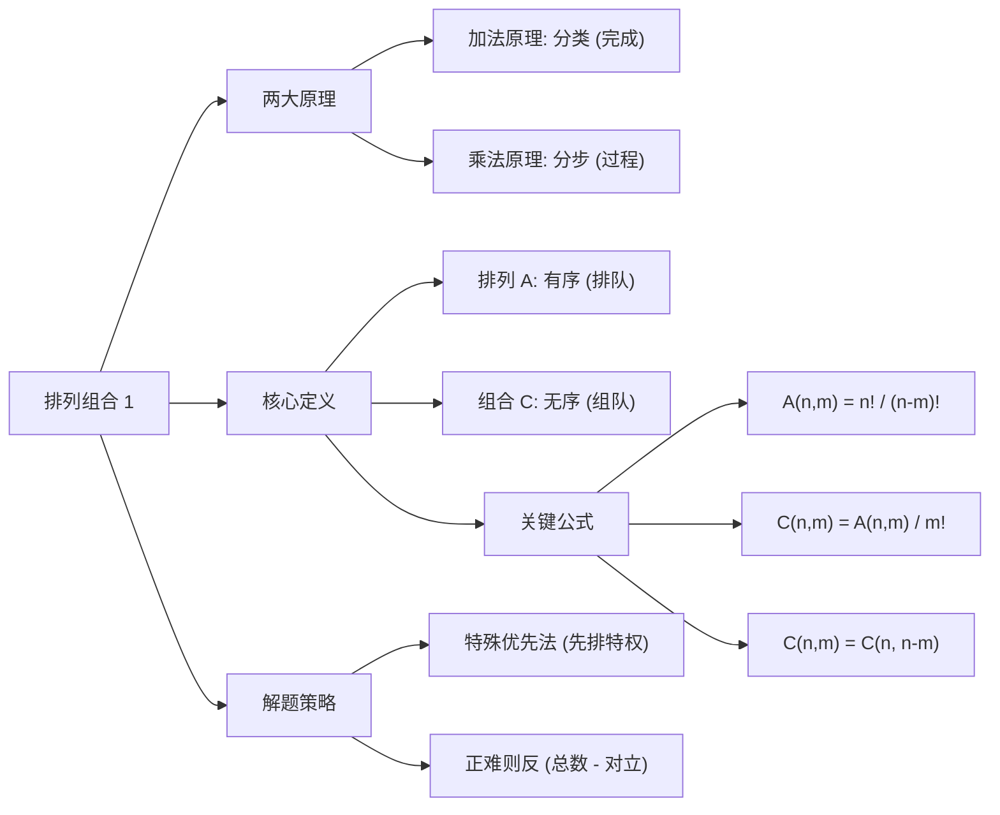

# 013 学习笔记：排列组合 1 (基础原理与核心公式)

你好，我是你的备考顾问。排列组合是管理类联考数学中**最极化**的章节：懂的人觉得像玩游戏一样简单，不懂的人觉得是玄学。

“排列组合 1”作为该模块的开篇，我们不谈花哨的技巧（如插空法、捆绑法，那些在后续章节），本章只解决一个核心问题：**如何正确地“数数”**。绝大多数做错题的考生，根源都在于没搞清“分步”还是“分类”，没搞清“有序”还是“无序”。

以下是本章的深度复习笔记。

---

### 第一部分：核心定义（基础地基）

本章的基石是**两个原理**和**两个定义**。

#### 1. 两个基本计数原理
这是所有排列组合题目的底层逻辑，必须烂熟于心：
*   **加法原理（分类计数）：** 完成一件事有 $n$ 类办法，第 1 类有 $m_1$ 种，第 2 类有 $m_2$ 种……则完成这件事共有 $N = m_1 + m_2 + \dots + m_n$ 种方法。
    *   *关键词：* **“分类”**、**“或者”**、**“殊途同归”**（每一类办法都能独立完成这件事）。
*   **乘法原理（分步计数）：** 完成一件事需要分 $n$ 个步骤，第 1 步有 $m_1$ 种，第 2 步有 $m_2$ 种……则完成这件事共有 $N = m_1 \times m_2 \times \dots \times m_n$ 种方法。
    *   *关键词：* **“分步”**、**“并且”**、**“缺一不可”**（每一步做完，事情还没结束）。

#### 2. 排列与组合（核心公式）
*   **排列 (Permutation)：** 从 $n$ 个不同元素中取出 $m$ 个元素，**按一定的顺序**排成一列。
    *   公式：$A_n^m = n(n-1)(n-2)\dots(n-m+1) = \frac{n!}{(n-m)!}$
    *   全排列：$A_n^n = n!$
    *   *注：部分教材使用 $P_n^m$，含义相同。*
*   **组合 (Combination)：** 从 $n$ 个不同元素中取出 $m$ 个元素**组成一组**，不考虑顺序。
    *   公式：$C_n^m = \frac{A_n^m}{m!} = \frac{n!}{m!(n-m)!}$
    *   **重要性质（必背）：**
        1.  $C_n^m = C_n^{n-m}$ （取出一半以上时，用补集思想算更在行）
        2.  $C_n^0 = C_n^n = 1$
        3.  $C_n^m + C_n^{m+1} = C_{n+1}^{m+1}$ （杨辉三角公式，虽考频低但偶尔有奇效）

---

### 第二部分：核心考点（考试套路）

#### 考点 1：有序 vs 无序的判定
*   **原理：** 区分是用 $A$ 还是 $C$，唯一的标准是**“交换选出的元素，结果是否改变”**。改变就是有序（用 A），不改变就是无序（用 C）。
*   **结论：**
    *   **有序场景（A）：** 站队、排课表、数字组成（12 和 21 不同）、担任不同职务。
    *   **无序场景（C）：** 握手、组队、分发相同物品、几何连线（AB 和 BA 是同一条线）。
*   **应用场景：** 所有排列组合题目的第一步判断。

#### 考点 2：特殊元素/位置优先策略
*   **原理：** “有特权者先安排”。无论是特殊元素（如数字 0）还是特殊位置（如排头、排尾），必须最先处理，剩下的元素再进行全排列或组合。
*   **口诀：** **特殊位置优先排，其余元素随后补。**
*   **应用场景：** 数字排列题（0 不能作首位）、排队题（甲必须在中间）、排课题（体育课不排上午）。

#### 考点 3：正难则反（排除法）
*   **原理：** 当正面情况极其复杂（比如“至少有 1 个”、“至多有 X 个”）时，计算所有可能的情况（全集），减去不满足条件的情况（补集）。
*   **公式：** **目标情况数 = 总数 - 对立面情况数**
*   **应用场景：** 题目出现“至少”、“至多”字眼，或者正面分类超过 3 类时。

---

### 第三部分：真题逻辑演练（文字解析）

#### **【例题 1】（数字排列与特殊位置）**
用 0, 1, 2, 3, 4, 5 这六个数字，可以组成多少个没有重复数字的四位奇数？

*   **文字解析：**
    1.  **第一步思路（识别限制）：** 这是一个典型的排列问题。限制条件有两个：① 是四位数（首位不能为 0）；② 是奇数（末位只能是 1, 3, 5）。
    2.  **第二步策略（优先特殊位置）：**
        *   **先看末位（奇数限制）：** 末位必须是奇数，从 {1, 3, 5} 中选 1 个，有 $C_3^1$ 种（即 3 种）选法。假设选了 1。
        *   **再看首位（0 的限制）：** 首位不能是 0，也不能是刚才末位选走的那个数（比如 1）。剩下的 5 个数字里，去掉 0 和 1，还剩 4 个可选。所以首位有 $C_4^1$ 种（即 4 种）选法。
        *   **最后排中间：** 此时首尾各占 1 个数字，总共 6 个数字还剩 4 个。中间两位没有限制，从这 4 个里选 2 个并排序，即 $A_4^2$。
    3.  **第三步计算（分步用乘法）：**
        *   总数 = （末位）$\times$ （首位）$\times$ （中间）
        *   $N = 3 \times 4 \times (4 \times 3) = 144$。
    4.  **结论：** 可以组成 144 个四位奇数。

#### **【例题 2】（组合与正难则反）**
某小组有 4 名男医生和 3 名女医生，现要选派 3 人参加医疗队，要求其中至少有 1 名女医生，共有多少种选法？

*   **文字解析：**
    1.  **第一步思路（判定类型）：** 选人组队，不分先后，属于**组合**问题（用 C）。
    2.  **第二步策略（逻辑选择）：**
        *   **正面思路（分类）：** “至少 1 名女医生”包含：1 女 2 男、2 女 1 男、3 女 0 男。需要算三次再相加，略繁琐。
        *   **反面思路（排除）：** 总选法 - （全是男医生）。这种方法更快。
    3.  **第三步计算：**
        *   **总选法：** 从 7 人（4 男+3 女）中任选 3 人：$C_7^3 = \frac{7 \times 6 \times 5}{3 \times 2 \times 1} = 35$ 种。
        *   **对立面（全是男）：** 从 4 名男医生中选 3 人：$C_4^3 = C_4^1 = 4$ 种。
        *   **做差：** $35 - 4 = 31$。
    4.  **结论：** 共有 31 种选法。

---

### 第四部分：避坑指南（考试心理）

1.  **分不清 $A$ 和 $C$：**
    *   *错误心态：* 拿到题就开始套公式，不管顺不顺序。
    *   *防坑口诀：* **“选人入座是 A，选人开会是 C；互换算两样是 A，互换算一样是 C。”**

2.  **忽视数字“0”的特殊性：**
    *   *错误操作：* 在做数字排列题时，忘记 0 不能做首位，或者忘记 0 也是偶数。
    *   *记忆技巧：* 看到“数字排列”，先把 **“0”** 字写在草稿纸最显眼的地方圈起来，时刻警惕它不能站排头。

3.  **“至少”问题死算：**
    *   *错误操作：* 看到“至少 2 个”，非要分三四类去算，结果算错一类全盘皆输。
    *   *防坑口诀：* **“看到至少想反面，总数减去不可能。”**

---

### 第五部分：考情分析（情报局）

*   **难度星级：** ⭐⭐⭐ (中等，但逻辑陷阱多)
*   **考频指数：** ⭐⭐⭐⭐⭐ (必考，每年 1-2 题基础题)
*   **命题趋势：**
    *   **近三年风向：** 纯粹的套公式计算题减少，**应用场景化**题目增多。题目越来越像“逻辑题”而非“计算题”。
    *   **结合点：** 常与“概率”结合考察，排列组合算不对，后面的古典概型题目也得不到分，属于“连环杀”。

---

### 第六部分：思维导图（知识网）

---

### 第七部分：针对 MEM/MBA 的复习建议

作为在职考生，你们的逻辑思维通常强于应届生，但计算手感较弱。建议如下：

1.  **拒绝题海，重在“翻译”：**
    不要盲目刷题。拿到一道题，先别动笔算，试着用中文把它翻译成“第一步做啥，第二步做啥”或者“情况 A 是啥，情况 B 是啥”。**逻辑通了，计算只是按计算器的工作。**

2.  **穷举法是保命绝招：**
    排列组合的题目，如果总数看起来很少（比如选项都是 10、20 左右），**千万别去想复杂的公式！** 直接把所有情况列出来（穷举），往往比套公式更快且不容易错。

3.  **每天 10 分钟“心算”：**
    利用碎片时间（通勤、开会间隙），自己给自己出题：比如“车牌号怎么算”、“午餐选菜怎么算”。保持对“有序”和“无序”的敏感度。

---
**专家寄语：** 排列组合不是数学计算，它是逻辑的艺术。理清了逻辑，你就是满分；理不清逻辑，背再多公式也是零分。加油！
