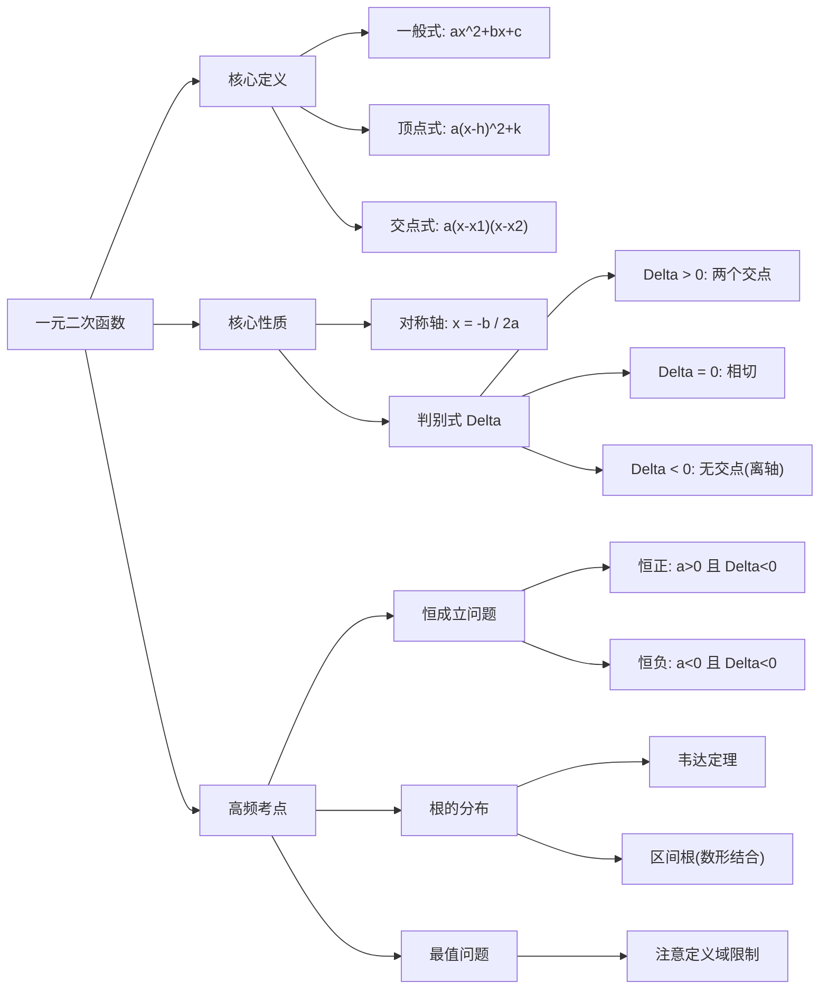

以下为您生成的 **管理类联考数学（199/396）— 一元二次函数及抛物线** 深度学习笔记。

---

# 学习笔记：一元二次函数及抛物线
**章节编号：** 1768473182684
**适用科目：** 管综 (199) / 经综 (396)
**专家评注：** 这是代数部分的“脊梁”。它向上承接方程与不等式，向下开启最值问题与解析几何。拿下这一章，意味着你握住了代数综合题的命门。

---

### 第一部分：核心定义（基础地基）

本章的核心在于 **“数形结合”**。不要只盯着方程看，脑子里必须要有图像。

1.  **三种解析式形式**（解题时根据已知条件灵活切换）：
    *   **一般式：** $f(x) = ax^2 + bx + c$ ($a \neq 0$)
        *   *用途：* 已知三点坐标，或仅涉及基本性质分析。
    *   **顶点式：** $f(x) = a(x-h)^2 + k$
        *   *用途：* 涉及 **最值**、**对称轴** 或 **顶点** 问题时，这是首选。
        *   *注：* 顶点坐标为 $(h, k)$，对称轴为 $x=h$。
    *   **交点式（两根式）：** $f(x) = a(x-x_1)(x-x_2)$
        *   *用途：* 已知抛物线与 $x$ 轴的交点 $(x_1, 0), (x_2, 0)$。
        *   *注：* 仅当 $\Delta \ge 0$ 时存在。

2.  **图像关键要素（决定抛物线长相的基因）：**
    *   **开口方向：** $a > 0$ 开口向上（有最小值）；$a < 0$ 开口向下（有最大值）。
    *   **对称轴：** $x = -\frac{b}{2a}$。这是抛物线的“脊椎”，决定了单调性区间。
    *   **判别式 $\Delta = b^2 - 4ac$：**
        *   $\Delta > 0$ $\Rightarrow$ 与 $x$ 轴有两个交点（方程有两个不等实根）。
        *   $\Delta = 0$ $\Rightarrow$ 与 $x$ 轴相切（方程有两个相等实根）。
        *   $\Delta < 0$ $\Rightarrow$ 与 $x$ 轴无交点（方程无实根，恒正或恒负）。

---

### 第二部分：核心考点（考试套路）

命题人通常不会直接考你“画图”，而是将其包装在方程根的分布、不等式恒成立或最值应用题中。

#### 考点 1：恒成立问题（恒正/恒负）
*   **原理：** 抛物线完全在 $x$ 轴上方或下方。
*   **结论（秒杀公式）：**
    *   $f(x) > 0$ 恒成立 $\iff$ **$a > 0$ 且 $\Delta < 0$**。
    *   $f(x) < 0$ 恒成立 $\iff$ **$a < 0$ 且 $\Delta < 0$**。
*   **应用场景：** 题目出现“对任意实数 $x$，不等式...恒成立”。**注意：** 必须警惕 $a=0$ 降次为一次函数的陷阱！

#### 考点 2：根的分布（区间根）
*   **原理：** 结合韦达定理或图像特征判断根的位置。
*   **结论：**
    *   两根符号判断：直接看 $x_1+x_2 = -\frac{b}{a}$ 和 $x_1x_2 = \frac{c}{a}$ 的符号。
    *   根在特定区间（如 $k < x_1 < x_2$）：需同时满足“三剑客”——**判别式 $\Delta$、对称轴位置、端点函数值符号**。
*   **应用场景：** “方程在 $(0, 2)$ 内有两个实根”或“一正根一负根”。

#### 考点 3：最值应用（利润/成本模型）
*   **原理：** 在闭区间 $[m, n]$ 上求 $f(x)$ 的最值。
*   **结论：** 
    *   若对称轴 $x = -\frac{b}{2a}$ 在区间内，顶点为极值点。
    *   若对称轴在区间外，函数在区间内单调，最值在端点 $m$ 或 $n$ 处取得。
    *   **口诀：** *“轴在内，看顶点；轴在外，看两端；轴动区定分类看。”*
*   **应用场景：** 管理类联考应用题中的最大利润、最小成本、最大面积问题。

---

### 第三部分：真题逻辑演练（文字解析）

#### 【例题 1】（恒成立陷阱）
若不等式 $kx^2 - 2x + 6k < 0$ 对一切实数 $x$ 恒成立，求实数 $k$ 的取值范围。

**【文字解析】：**
这是一道经典的“防坑”题，逻辑链条如下：
1.  **第一步（识别陷阱）：** 观察最高次项系数含参数 $k$。切记，题目未说这是“二次”不等式。
    *   若 $k=0$，不等式变为 $-2x < 0$，显然不是对“一切实数”恒成立，排除 $k=0$。
2.  **第二步（回归二次）：** 既然是一元二次不等式，要保证“恒小于 0”（图像整体在 x 轴下方），必须满足两个硬性条件：
    *   开口向下：$k < 0$
    *   与 x 轴无交点：$\Delta < 0$
3.  **第三步（计算）：**
    *   $\Delta = (-2)^2 - 4(k)(6k) = 4 - 24k^2$
    *   令 $4 - 24k^2 < 0 \Rightarrow 1 - 6k^2 < 0 \Rightarrow k^2 > \frac{1}{6}$
    *   解得 $k > \frac{\sqrt{6}}{6}$ 或 $k < -\frac{\sqrt{6}}{6}$。
4.  **第四步（综上结论）：**
    *   结合条件 $k < 0$，最终答案为 $k < -\frac{\sqrt{6}}{6}$。

---

#### 【例题 2】（最值应用题模型）
某产品售价 $x$ 元（$10 \le x \le 20$），销量 $Q = -2x + 60$，成本 $C = 10$ 元/件。求售价定为多少时，总利润最大？

**【文字解析】：**
1.  **第一步（建立模型）：**
    *   总利润 $L(x) = (\text{单价} - \text{成本}) \times \text{销量}$
    *   $L(x) = (x - 10)(-2x + 60)$
    *   化简整理（不一定要展开成一般式，保留因子有时更易看对称轴）：$L(x) = -2(x-10)(x-30)$。
2.  **第二步（分析图像）：**
    *   这是一个开口向下的抛物线（$a=-2 < 0$）。
    *   与 x 轴交点为 $10$ 和 $30$。
    *   **对称轴**：$x = \frac{10+30}{2} = 20$。
3.  **第三步（结合定义域）：**
    *   题目限制 $10 \le x \le 20$。
    *   抛物线在对称轴左侧单调递增。
    *   对称轴 $x=20$ 恰好在定义域的右端点上。
4.  **结论：**
    *   当 $x = 20$ 时，利润取最大值。
    *   此时 $L(20) = (20-10) \times (-40+60) = 10 \times 20 = 200$ 元。

---

### 第四部分：避坑指南（考试心理）

在考场高压下，90% 的考生会死在以下 2 个坑里：

1.  **“系数含参”遗漏讨论**
    *   *错误：* 看到 $ax^2+bx+c$ 直接按二次函数做。
    *   *防坑口诀：* **“见二次系数有字母，先问自己等不等零。”**
2.  **“最值范围”无视区间**
    *   *错误：* 求二次函数最值，闭着眼睛套顶点公式 $(4ac-b^2)/4a$。
    *   *防坑口诀：* **“求最值，画草图；看对称轴，在不在定义域里。”** 若对称轴跑出去了，顶点公式就是错的！

---

### 第五部分：考情分析（情报局）

*   **难度星级：** ⭐⭐⭐⭐ (中等偏难，难在综合)
*   **考频指数：** ⭐⭐⭐⭐⭐ (每年必考，1-2题)
*   **命题趋势：**
    *   **变活：** 单纯考“求解析式”的题目绝迹了。现在更倾向于结合 **不等式恒成立** 或 **绝对值函数**（如 $y = |x^2 - 1|$）来考察。
    *   **结合实际：** MEM/MBA 的应用题中，二次函数是构建“利润最大化”模型的首选工具。

---

### 第六部分：思维导图（知识网）

---

### 第七部分：针对 MEM/MBA 的复习建议

在职考生时间宝贵，不要搞题海战术，建议如下：

1.  **画图解千愁：** 无论题目多么抽象，只要涉及二次函数，**第一时间在草稿纸上画出抛物线草图**。标出开口、对称轴和交点，答案往往就在图上，比推公式快一倍。
2.  **抓大放小：** 对于极其复杂的“根的分布”讨论（如动轴动区间），如果两分钟内理不清思路，果断用**特值法**（取 $a=1, b=2$ 等）排除选项，或者直接跳过。
3.  **应用题模型化：** 熟练掌握“单价-销量”利润模型。这类题考频极高，且套路固定（设涨价/降价 $x$ 元），是必须拿下的送分题。

---
欢迎来到数学的“抛物线乐园”！把一元二次函数想象成一个**“表情包”**，它的图像要么是**笑脸**（开口向上），要么是**哭脸**（开口向下）。

既然你说自己是小白，那我们不玩虚的，直接从最底层的逻辑开始，拆解这个“表情包”的构造。

---

### 第一部分：初识一元二次函数（它的长相）

所有的抛物线都可以写成这个样子（**一般式**）：
$$y = ax^2 + bx + c$$

这里有三个核心角色：
1.  **$a$（脾气）：** 它决定了开口方向。
    *   $a > 0$：正能量，**笑脸**（开口向上）。
    *   $a < 0$：负能量，**哭脸**（开口向下）。
    *   $|a|$ 越大，开口越窄；$|a|$ 越小，开口越宽。
2.  **$b$（位移）：** 它和 $a$ 共同决定了抛物线是往左撇还是往右撇。
3.  **$c$（起点）：** 它是抛物线与 $y$ 轴相交的位置（令 $x=0$ 时的值）。

---

### 第二部分：核心概念——顶点与对称轴

抛物线是一个**完美的对称图形**。

1.  **对称轴（中轴线）：** 像镜子一样，把抛物线平分成左右完全一样的两半。
2.  **顶点（极值点）：** 
    *   笑脸的最底端（最小值）。
    *   哭脸的最顶端（最大值）。
    *   **记住：顶点一定就在对称轴上！**

---

### 第三部分：计算逻辑（重点：怎么来的？）

书上给出了一个很吓人的公式：$y = a(x + \frac{b}{2a})^2 + \frac{4ac-b^2}{4a}$。
小白不需要死记硬背这个，我们看它的**推导逻辑**：

#### 逻辑 1：配方法（变身术）
我们要把 $ax^2 + bx + c$ 变成一种**“完全平方”**的形式，即 $y = a(x-h)^2 + k$。
*   这个形式叫**顶点式**。
*   一旦变成了这个样子，**顶点坐标就是 $(h, k)$**，**对称轴就是 $x = h$**。

#### 逻辑 2：万能公式（秒杀术）
如果你不想每次都配方，数学家已经帮你算好了“快捷键”：

1.  **先找对称轴：**
    $$x = -\frac{b}{2a}$$
    *   这是全书最重要的公式，一定要背下来！
2.  **再找顶点：**
    *   顶点的横坐标就是对称轴：$h = -\frac{b}{2a}$。
    *   顶点的纵坐标 $k$：你可以背公式 $\frac{4ac-b^2}{4a}$，**但我更建议小白直接把算出来的 $x$ 代入原方程算 $y$。**

---

### 第四部分：实例拆解（以图中 $y = x^2 - 2x - 3$ 为例）

我们来手把手算一遍：

**1. 提取参数：**
$a = 1$ (大于0，笑脸), $b = -2$, $c = -3$。

**2. 算对称轴：**
公式：$x = -\frac{b}{2a}$
代入：$x = -\frac{-2}{2 \times 1} = \frac{2}{2} = 1$
**结论：对称轴是直线 $x = 1$。**

**3. 算顶点：**
既然知道顶点的 $x = 1$，把它塞回方程算 $y$：
$y = 1^2 - 2 \times 1 - 3$
$y = 1 - 2 - 3 = -4$
**结论：顶点坐标是 $(1, -4)$。**

**4. 验证（配方法逻辑）：**
$y = x^2 - 2x - 3$
$y = (x^2 - 2x \mathbf{+ 1}) - 1 - 3$ （凑出 $x^2-2x+1$ 是为了变成 $(x-1)^2$）
$y = (x-1)^2 - 4$
你看，这就是**顶点式**。一眼看出顶点是 $(1, -4)$。

---

### 第五部分：给小白的“避坑小贴士”

1.  **符号杀手：** 公式是 $x = -\frac{b}{2a}$，如果 $b$ 本身是负数，负负得正。很多同学在这里丢分。
2.  **左右移动：** 
    *   在顶点式 $y = a(x-h)^2 + k$ 中，括号里是“减”，对应坐标是“正”。
    *   口诀：**左加右减，上加下减**（括号内管左右，外面管上下）。
3.  **判别式 $\Delta$ 的关联：**
    *   还记得 $\Delta = b^2 - 4ac$ 吗？
    *   如果顶点纵坐标和开口方向冲突（比如笑脸的顶点在 $x$ 轴上方），那就说明抛物线和 $x$ 轴没交点，即 $\Delta < 0$。

### 总结文档（建议保存）

*   **一般式：** $y = ax^2 + bx + c$
*   **中轴线（对称轴）：** $x = -\frac{b}{2a}$
*   **最高/低点（顶点）：** $(-\frac{b}{2a}，\frac{4ac-b^2}{4a})$
*   **小白最强策略：** 先背过对称轴公式算出 $x$，再代入算 $y$。

现在你对着这张图看：对称轴是不是在 $x=1$ 的位置？最底部的那个点是不是在 $(1, -4)$？数学就是这么严丝合缝！
