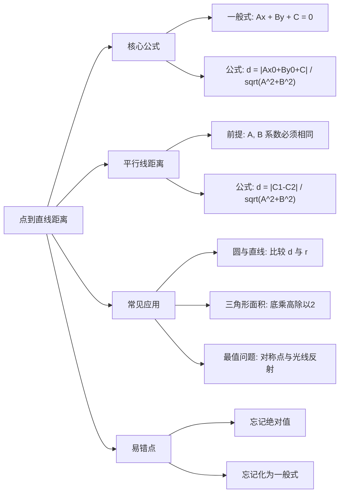

# 学习笔记：公式推导之点到直线的距离

**章节编号：** 1768533049863
**适用学科：** 管理类联考数学 (199/396)

---

### 第一部分：核心定义（基础地基）

本章是解析几何的基石，连结了“点”与“线”的关系。在考场上，它往往不是一道独立的题，而是解决圆、最值、三角形面积等复杂问题的**关键工具**。

#### 1. 点到直线的距离公式
已知点 $P(x_0, y_0)$ 和直线 $L: Ax + By + C = 0$，则点 $P$ 到直线 $L$ 的距离 $d$ 为：
$$d = \frac{|Ax_0 + By_0 + C|}{\sqrt{A^2 + B^2}}$$

> **专家批注：**
> *   公式中的直线方程**必须**化为**一般式** ($Ax + By + C = 0$) 才能代入系数。如果题目给出的是点斜式或截距式，第一步必须变形。
> *   分母 $\sqrt{A^2 + B^2}$ 是法向量的模，分子是点代入方程后的值的绝对值。
> *   **切记：** 距离 $d$ 永远是非负的，绝对值符号 $|\cdot|$ 绝不能丢！

#### 2. 两平行直线间的距离公式
若两条直线 $L_1$ 和 $L_2$ 平行，且方程分别为：
$L_1: Ax + By + C_1 = 0$
$L_2: Ax + By + C_2 = 0$
则这两条平行线之间的距离 $d$ 为：
$$d = \frac{|C_1 - C_2|}{\sqrt{A^2 + B^2}}$$

> **专家批注：**
> *   使用此公式的前提是 $x, y$ 的系数 $A, B$ **必须完全相同**。
> *   若 $L_1: x + 2y + 1 = 0$， $L_2: 2x + 4y + 3 = 0$，必须先将 $L_2$ 化简为 $x + 2y + 1.5 = 0$ 或将 $L_1$ 扩大为 $2x + 4y + 2 = 0$ 后方可使用公式。

---

### 第二部分：核心考点（考试套路）

#### 考点一：距离公式的直接计算与参数反求
*   **原理：** 考察对公式的熟练度及绝对值方程的求解。
*   **秒杀结论：** 看到“距离为 $d$”，直接列方程 $\frac{|Ax_0 + By_0 + C|}{\sqrt{A^2 + B^2}} = d$。注意去绝对值通常会有**两个解**（几何意义：直线两侧各有一条符合条件的线或点）。
*   **应用场景：** 已知距离求直线方程参数、已知距离求点坐标。

#### 考点二：圆与直线的相切/相交问题
*   **原理：** 用“圆心到直线的距离 $d$”与“半径 $r$”的大小关系来判断位置。
*   **核心逻辑：**
    *   $d < r \Rightarrow$ 相交（弦长问题）
    *   $d = r \Rightarrow$ **相切**（最常考，切线判定）
    *   $d > r \Rightarrow$ 相离（圆上的点到直线的最值问题）
*   **应用场景：** 求切线方程、求圆上一点到直线距离的最大/最小值。

#### 考点三：三角形面积问题（底高模型）
*   **原理：** 坐标系中求三角形面积，通常选一条边长易求的边做底，顶点到该边的距离即为高。
*   **公式：** $S = \frac{1}{2} \cdot |AB| \cdot d_{C \to AB}$
*   **应用场景：** 动点构成的三角形面积最值、解析几何中的多边形面积计算。

---

### 第三部分：真题逻辑演练（文字解析）

#### 【例题 1】（经典参数反求）
已知点 $A(a, 2)$ 到直线 $l: 3x + 4y - 2 = 0$ 的距离为 2，则 $a$ 的值为（ ）。

**文字解析：**
1.  **第一步：识别考点**。题目直白地给出了点、直线和距离，要求参数 $a$。这是标准的“点到直线距离公式”应用。
2.  **第二步：代入公式**。
    *   直线是一般式 $3x+4y-2=0$，系数 $A=3, B=4$。
    *   这就构成了经典的“勾3股4弦5”模型，分母 $\sqrt{3^2+4^2} = 5$。
    *   将点 $(a, 2)$ 代入分子：$|3a + 4(2) - 2| = |3a + 6|$。
3.  **第三步：列式求解**。
    *   方程为：$\frac{|3a + 6|}{5} = 2$。
    *   整理得：$|3a + 6| = 10$。
    *   **关键点**：去绝对值要考虑正负。
    *   情况一：$3a + 6 = 10 \Rightarrow 3a = 4 \Rightarrow a = 4/3$。
    *   情况二：$3a + 6 = -10 \Rightarrow 3a = -16 \Rightarrow a = -16/3$。
4.  **结论：** $a$ 的值为 $4/3$ 或 $-16/3$。

#### 【例题 2】（平行线距离陷阱）
直线 $L_1: 3x - 4y + 5 = 0$ 与直线 $L_2: 6x - 8y + C = 0$ 之间的距离为 2，且 $C > 0$，则 $C = $ （ ）。

**文字解析：**
1.  **第一步：观察陷阱**。两直线平行，但系数不统一！
    *   $L_1$ 的系数是 $(3, -4)$。
    *   $L_2$ 的系数是 $(6, -8)$。
    *   **必须统一**：将 $L_1$ 扩大 2 倍，变为 $6x - 8y + 10 = 0$。（或者将 $L_2$ 除以 2，但在处理 $C$ 时容易出错，建议扩大 $L_1$）。
2.  **第二步：套用平行线距离公式**。
    *   现在 $L_1: 6x - 8y + 10 = 0$， $L_2: 6x - 8y + C = 0$。
    *   分母：$\sqrt{6^2 + (-8)^2} = \sqrt{36+64} = 10$。
    *   公式：$d = \frac{|10 - C|}{10} = 2$。
3.  **第三步：求解与筛选**。
    *   $|10 - C| = 20$。
    *   解得：$10 - C = 20 \Rightarrow C = -10$；或者 $10 - C = -20 \Rightarrow C = 30$。
    *   **回归题设**：题目要求 $C > 0$。
    *   排除 $-10$，保留 $30$。
4.  **结论：** $C = 30$。

---

### 第四部分：避坑指南（考试心理）

#### 1. 系数不统一的“平行陷阱”
*   **错误：** 看到两平行线直接把常数项相减，忽略了 $x, y$ 系数必须一致。
*   **后果：** 算出错误答案，且选项中一定有这个干扰项。
*   **防坑口诀：** **平行距离要能求，系数必须先凑熟。**

#### 2. 绝对值漏解的“半吊子”
*   **错误：** 解 $|x| = a$ 时只写 $x = a$，忘了 $x = -a$。
*   **后果：** 导致漏选，尤其在充分性判断题中直接暴毙。
*   **防坑口诀：** **去绝对值不加负，考试分数留不住。**

#### 3. 直线形式的“想当然”
*   **错误：** 题目给出 $y = kx + b$，直接令 $A=k, B=1$ 代入公式。
*   **后果：** 符号全错。
*   **对策：** 必须先移项变形为 $kx - y + b = 0$，此时 $A=k, B=-1$。

---

### 第五部分：考情分析（情报局）

*   **难度星级：** ⭐⭐⭐ (中等难度，重在计算准确性)
*   **考频指数：** ⭐⭐⭐⭐⭐ (极高频，必考考点)
*   **命题趋势：**
    *   **不再单独考察：** 近三年很少单独出一道“求距离”的题。
    *   **融合考察：** 更多作为中间步骤出现在“直线与圆的位置关系”、“最值问题”或“线性规划(求区域面积)”中。
    *   **数字特征：** 命题人偏爱勾股数（3-4-5，5-12-13，6-8-10），目的是减少考生的开根号计算量，考察逻辑而非纯计算。

---

### 第六部分：思维导图（知识网）

---

### 第七部分：针对 MEM/MBA 的复习建议

1.  **抓大放小，不纠结推导**：
    在职备考时间宝贵，**不要**花时间去研究“向量法”或“面积法”推导这个公式的过程。请直接**死记硬背**上述两个公式，做到像背乘法口诀一样熟练。

2.  **训练“勾股数”敏感度**：
    看到直线系数是 $3x, 4y$，脑子里马上反应分母是 5；看到 $5x, 12y$，反应分母是 13。这能帮你节省 30% 的计算时间。

3.  **计算洁癖**：
    本章最容易出错的不是思路，而是简单的加减乘除和符号。建议每天做 3 道此类真题，强制自己写出完整步骤，直到连续 3 天全对为止。**算对，比算快更重要。**
