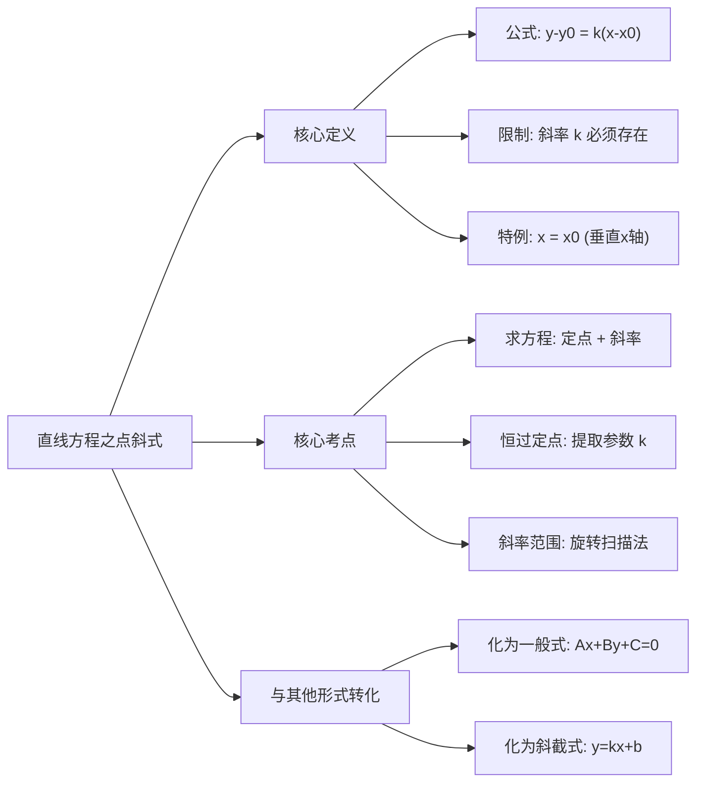

# 考研/MEM 数学深度学习笔记：直线方程之点斜式公式
**章节编号：** 1768549945235

---

### 第一部分：核心定义（基础地基）

点斜式方程是解析几何中最基础、应用最广的直线方程形式，它是从几何直观到代数表达的桥梁。

1.  **标准公式：**
    已知直线 $l$ 经过点 $P_0(x_0, y_0)$，且斜率为 $k$，则直线的方程为：
    $$y - y_0 = k(x - x_0)$$

2.  **核心三要素：**
    *   **定点：** $(x_0, y_0)$，直线“挂”在这个钉子上。
    *   **方向（斜率）：** $k = \tan \alpha$（$\alpha$ 为倾斜角），决定直线的旋转角度。
    *   **变量：** $(x, y)$，代表直线上任意一点的坐标。

3.  **重要限制（易错点）：**
    *   点斜式公式 **不适用于斜率不存在（即垂直于 x 轴）** 的直线。
    *   当直线垂直于 $x$ 轴时，倾斜角为 $90^\circ$，斜率 $k$ 无意义，此时方程直接写作：$x = x_0$。

---

### 第二部分：核心考点（考试套路）

在管理类联考中，点斜式很少单独考“填空”，更多是结合圆、最值问题进行综合考察。

#### 考点一：求直线方程（常规武器）
*   **原理：** “点”定位，“斜”定向。只要找到直线上一点和斜率，立刻写出方程。
*   **结论：**
    *   若已知直线与 $l_1: A_1x + B_1y + C_1 = 0$ **平行**，则斜率 $k = -\frac{A_1}{B_1}$。
    *   若已知直线与 $l_1: A_1x + B_1y + C_1 = 0$ **垂直**，则斜率 $k = \frac{B_1}{A_1}$ （负倒数关系）。
*   **应用场景：** 求切线方程、中垂线方程、三角形的高线方程。

#### 考点二：恒过定点问题（核心难点）
*   **原理：** 逆向思维。将含参数 $k$ 的方程整理为点斜式 $y - y_0 = k(x - x_0)$ 的形式，无论 $k$ 取何值，等式左边为0，右边为0，恒成立。
*   **秒杀结论：**
    对于方程 $y = kx + b(k)$，如果能整理成 $y - \text{常数} = k(x - \text{常数})$，则直线恒过该常数点。
*   **应用场景：** 题目出现“无论 $k$ 取何值，直线恒过点P”，或求“直线系”旋转时的几何性质。

#### 考点三：数形结合求斜率范围（高频考法）
*   **原理：** 将方程视为“绕定点旋转的扫描线”。
*   **结论：** 先求出定点，再根据直线与线段相交、与圆相离/相切等几何位置，画图确定 $k$ 的边界。
*   **应用场景：** 线性规划变形题、直线与线段相交问题。

---

### 第三部分：真题逻辑演练（文字解析）

#### 【例题 1】基础应用与变形
已知直线 $l$ 过点 $P(1, 2)$，且与直线 $2x + y - 5 = 0$ 垂直，求直线 $l$ 的方程。

*   **文字解析：**
    1.  **第一步（提炼斜率）：** 观察参照直线 $2x + y - 5 = 0$，化简得 $y = -2x + 5$，可知其斜率 $k_{ref} = -2$。
    2.  **第二步（利用垂直关系）：** 待求直线 $l$ 与之垂直，故 $k_l \times k_{ref} = -1$，解得 $k_l = \frac{1}{2}$。
    3.  **第三步（点斜式落笔）：** 已知点 $(1, 2)$，斜率 $\frac{1}{2}$。代入公式 $y - 2 = \frac{1}{2}(x - 1)$。
    4.  **第四步（整理一般式）：** 两边同乘2，整理得 $2y - 4 = x - 1$，即 **$x - 2y + 3 = 0$**。
    *   *老师点评：* 这是送分题，核心在于“负倒数”关系，最后一步务必化为一般式（$Ax+By+C=0$），符合选项习惯。

#### 【例题 2】恒过定点与范围（实战难题）
直线 $l: kx - y - 2k + 3 = 0$ 与连接 $A(0, 2)$ 和 $B(4, 0)$ 的线段 $AB$ 有公共点，求实数 $k$ 的取值范围。

*   **文字解析：**
    1.  **第一步（挖掘定点）：** 看到参数 $k$，立刻整理方程。将含 $k$ 项合并：$k(x - 2) - (y - 3) = 0$。变形为点斜式 $y - 3 = k(x - 2)$。
    2.  **第二步（几何意义）：** 这代表直线恒过定点 $P(2, 3)$，斜率为 $k$。
    3.  **第三步（数形结合）：** 在草稿纸上画出点 $A(0,2)$，点 $B(4,0)$ 以及定点 $P(2,3)$。
    4.  **第四步（临界值计算）：** 直线绕 $P$ 点旋转，要“扫”到线段 $AB$，必须在 $PA$ 和 $PB$ 之间。
        *   算斜率 $k_{PA} = \frac{3-2}{2-0} = \frac{1}{2}$。
        *   算斜率 $k_{PB} = \frac{3-0}{2-4} = -\frac{3}{2}$。
    5.  **第五步（结论判定）：** 观察图形，直线从 $PB$（负斜率）逆时针转到 $y$ 轴（垂直），再转到 $PA$（正斜率）。
        注意：直线斜率 $k$ 的变化是跳跃的。
        $k$ 必须 $\le k_{PB}$ 或者 $k \ge k_{PA}$。
    *   **结论：** **$k \in (-\infty, -\frac{3}{2}] \cup [\frac{1}{2}, +\infty)$**。
    *   *老师点评：* 很多人算出两个数直接写中间范围 $[-\frac{3}{2}, \frac{1}{2}]$，大错特错！一定要画图看斜率的变化趋势（陡峭程度），中间部分其实是“空”的。

---

### 第四部分：避坑指南（考试心理）

1.  **深坑一：忽略“斜率不存在”**
    *   题目若设“直线 $l$ 过点 $(1,2)$”，千万别直接设 $y-2=k(x-1)$ 完事。必须分两类讨论：① 斜率存在；② 斜率不存在（$x=1$）。
    *   **防坑口诀：** *设线先设斜，由于 $k$ 有无。斜率若未知，垂直单独图。*

2.  **深坑二：截距与距离混淆**
    *   点斜式推导出的截距式，截距（Intercept）是有正负的，而距离（Distance）永远非负。题目说“截距相等”，可能是 $a=b$ 或 $a=-b$；题目说“截距距离相等”，是 $|a|=|b|$。

3.  **深坑三：公式记忆错位**
    *   不要把 $y - y_0 = k(x - x_0)$ 写成 $x - x_0 = k(y - y_0)$，这是考场高压下常见低级错误。记住：**左边是 $y$，右边是 $x$**。

---

### 第五部分：考情分析（情报局）

*   **难度星级：** ⭐⭐ (基础但灵活)
*   **考频指数：** ⭐⭐⭐⭐⭐ (几乎每年必考，多作为解题工具出现)
*   **命题趋势：**
    *   **弱化计算，强化几何：** 以前考纯代数化简，现在更倾向于考“直线系”旋转扫过区域的面积、或者与圆结合的最值问题。
    *   **隐蔽性增强：** 直线方程不再直接给出，而是隐藏在物理背景（如线性规划的应用题）或动点轨迹中。

---

### 第六部分：思维导图（知识网）

---

### 第七部分：针对 MEM/MBA 的复习建议

对于在职考生（MEM/MBA/EMBA），时间碎片化，数学功底可能已生疏，建议如下：

1.  **抓大放小，掌握“万能钥匙”：**
    不要死记硬背“两点式”、“截距式”等所有

---

这是解析几何中**最常用、也是最人性化**的一个直线方程表达形式。

如果说“一般式”（$Ax+By+C=0$）是直线的“身份证号”，那么**“点斜式”**就是直线的**“导航指令”**：它告诉你**从哪个点出发（点）**，以及**往哪个方向走（斜率）**。

---

### 一、 点斜式的公式

已知直线经过一个点 $P(x_0, y_0)$，且它的斜率为 $k$，那么直线的方程为：

$$y - y_0 = k(x - x_0)$$

*   **$(x_0, y_0)$**：这是直线上的一个“定点”（已知坐标）。
*   **$k$**：这是直线的斜率（倾斜程度）。
*   **$x, y$**：这是直线上任意一点的坐标（变量）。

---

### 二、 底层原理：它是怎么来的？

这个公式其实就是**斜率公式**的变形。

1.  **斜率的定义**：斜率 $k$ 等于“纵坐标的变化”除以“横坐标的变化”。
    $$k = \frac{y - y_0}{x - x_0}$$
2.  **简单变形**：把分母 $(x - x_0)$ 乘到等号对面去：
    $$k(x - x_0) = y - y_0$$
3.  **结果**：这就得到了点斜式。

**逻辑理解：** 只要直线上任意一点 $(x, y)$ 与定点 $(x_0, y_0)$ 连线的斜率永远等于 $k$，那么这些点连起来就是我们要的那条直线。

---

### 三、 为什么 MEM 考试最爱用它？

在 MEM 数学题中，很少有题目直接给你 $y = kx + b$。通常的套路是：
1.  **场景 A**：已知直线经过点 $(1, 2)$，且与另一条直线平行（意味着斜率 $k$ 相同）。
2.  **场景 B**：已知直线经过点 $(-1, 3)$，且与另一条直线垂直（意味着斜率相乘等于 $-1$）。

在这些情况下，你手里有**“一个点”**和**“一个斜率”**，用点斜式写方程是最快的，不需要去解方程组算 $b$。

---

### 四、 傻瓜式操作案例

**【题目】** 求经过点 $(2, -3)$，且斜率为 $5$ 的直线方程。

**【操作步骤】**
1.  **找组件**：$x_0 = 2, y_0 = -3, k = 5$。
2.  **套公式**：$y - (-3) = 5(x - 2)$。
3.  **化简**（变号要小心）：
    *   $y + 3 = 5x - 10$
    *   $y = 5x - 13$ （这就变成了你熟悉的斜截式）

---

### 五、 点斜式的“双胞胎”：两点式

如果你手里没有斜率 $k$，但是有**两个点** $P_1(x_1, y_1)$ 和 $P_2(x_2, y_2)$，怎么办？

**逻辑是相同的：**
1.  先用两个点算出斜率 $k = \frac{y_2 - y_1}{x_2 - x_1}$。
2.  再随便挑其中一个点，套入点斜式。

---

### 六、 给小白的特别提醒（避坑指南）

1.  **减号陷阱**：公式里是 $y \mathbf{-} y_0$ 和 $x \mathbf{-} x_0$。
    *   如果点坐标是负数（比如 $-2$），代入后会变成 $x - (-2)$，也就是 **$x + 2$**。这是新手最容易错的地方。
2.  **垂直线的特例**：如果直线是垂直于 $x$ 轴的（比如 $x = 3$），它是没有斜率的（$k$ 不存在），这种情况下点斜式**失效**，直接写 $x = x_0$ 即可。
3.  **转换意识**：在 MEM 考试中，点斜式通常是你的**“中间工具”**。写出点斜式后，通常要把它化简成“一般式” $Ax+By+C=0$，因为接下来的“点到直线距离公式”需要用到一般式。

**总结：**
*   **一般式**：适合算距离（$d$ 公式）。
*   **点斜式**：适合写方程（已知点和方向）。
*   **斜截式**：适合看图像（$k$ 坡度，$b$ 截距）。

你现在能试着写出“经过原点 $(0,0)$ 且斜率为 $k$”的直线方程吗？你会发现它变得异常简单。