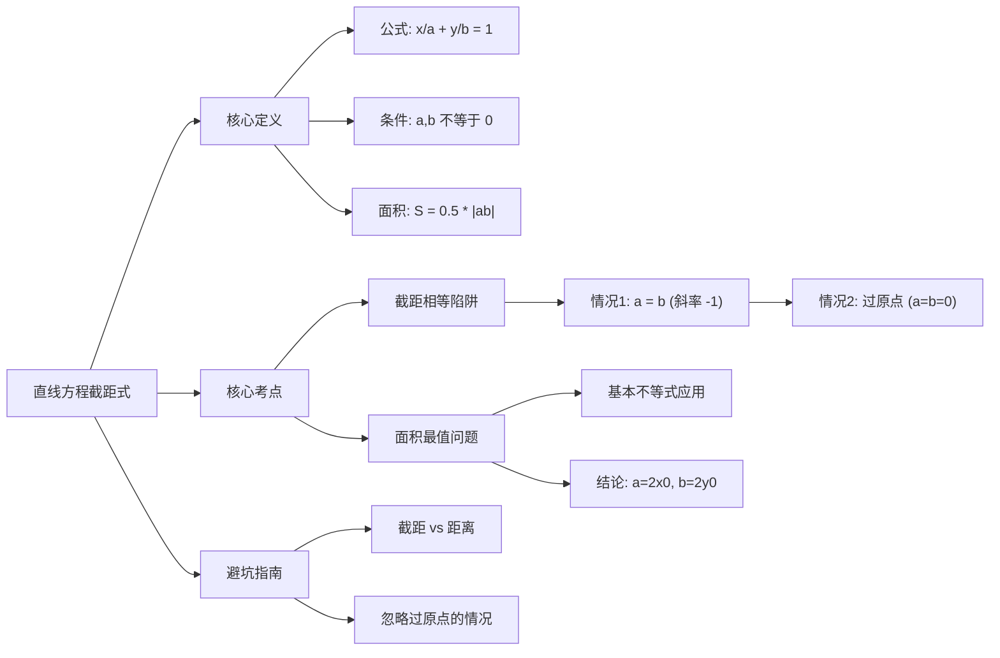

# 考研/MEM 数学备考笔记：直线方程之截距式

**章节编号：** 1768550360899
**主题：** 直线方程之截距式公式
**适用对象：** 管理类联考（MBA/MEM/MPAcc等）考生

---

### 第一部分：核心定义（基础地基）

截距式方程是解析几何中解决“直线与坐标轴围成图形”类问题的核心工具，其形式优美但在使用时有严格的限制条件。

1.  **截距式方程公式：**
    若直线 $l$ 在 $x$ 轴上的截距为 $a$，在 $y$ 轴上的截距为 $b$（其中 $a \neq 0$ 且 $b \neq 0$），则直线方程可写为：
    $$ \frac{x}{a} + \frac{y}{b} = 1 $$

2.  **核心概念辨析：**
    *   **截距（Intercept）：** 截距是**坐标值**，实数，**可正、可负、可为零**。
        *   例如：直线过点 $(3, 0)$，则 $x$ 轴截距 $a=3$。
        *   例如：直线过点 $(0, -5)$，则 $y$ 轴截距 $b=-5$。
    *   **距离（Distance）：** 截距的绝对值才是原点到交点的距离，永远非负。

3.  **围成三角形面积公式：**
    直线 $\frac{x}{a} + \frac{y}{b} = 1$ 与两坐标轴围成的直角三角形面积为：
    $$ S = \frac{1}{2} |a \cdot b| $$

> **警示：** 只有当直线与 $x$ 轴、$y$ 轴都有交点且不经过原点时，才可以直接设为截距式。**凡是未明确排除过原点的情况，直接设截距式必死无疑。**

---

### 第二部分：核心考点（考试套路）

本章在联考中主要考察以下三个核心维度的转化：

#### 考点一：直线与坐标轴围成的面积问题
*   **原理：** 利用 $S = \frac{1}{2}|ab|$ 将几何面积转化为代数方程。
*   **公式：** 已知过点 $P(x_0, y_0)$，代入方程得 $\frac{x_0}{a} + \frac{y_0}{b} = 1$，联立面积公式求解。
*   **应用场景：** 题目出现“直线与坐标轴围成三角形面积为...”或“求面积最小值”。

#### 考点二：“截距相等”或“截距互为相反数”
*   **原理：** 考察分类讨论思想。
*   **结论：**
    1.  **截距相等 ($a=b$)：** 直线斜率 $k = -1$ **或者** 直线过原点。
    2.  **截距互为相反数 ($a=-b$)：** 直线斜率 $k = 1$ **或者** 直线过原点。
    3.  **截距绝对值相等 ($|a|=|b|$)：** 直线斜率 $k = \pm 1$ **或者** 直线过原点。
*   **应用场景：** 条件充分性判断题高频考点。

#### 考点三：面积最值问题（基本不等式应用）
*   **原理：** “积定和最小，和定积最大”。
*   **公式：** 直线过第一象限定点 $(m, n)$ $(m>0, n>0)$，则与坐标轴围成的三角形面积最小值为 $S_{min} = 2mn$。
    *   此时截距分别为 $a=2m$, $b=2n$。
*   **应用场景：** 求解最优化问题。

---

### 第三部分：真题逻辑演练（文字解析）

**【例题 1】（经典陷阱题）**
直线 $l$ 过点 $P(1, 2)$，且在两坐标轴上的截距相等，求直线 $l$ 的方程。

*   **文字解析：**
    1.  **第一步（识别陷阱）：** 看到“截距相等”，大部分考生会直接设 $\frac{x}{a} + \frac{y}{a} = 1$，这是典型的**漏解**思维。必须分两种情况讨论。
    2.  **第二步（情形一：截距不为0）：** 设直线方程为 $\frac{x}{a} + \frac{y}{a} = 1$（即 $x+y=a$）。将点 $(1, 2)$ 代入，得 $1+2=a \Rightarrow a=3$。此时方程为 $x + y - 3 = 0$。
    3.  **第三步（情形二：截距为0）：** 直线过原点，此时横纵截距都是0，满足“截距相等”。设方程为 $y = kx$，代入 $(1, 2)$ 得 $k=2$。此时方程为 $2x - y = 0$。
    4.  **结论：** 直线方程为 $x + y - 3 = 0$ 或 $2x - y = 0$。

**【例题 2】（最值秒杀题）**
过点 $P(3, 4)$ 的直线 $l$ 与两坐标轴的正半轴分别交于 $A, B$ 两点，当 $\triangle OAB$ 面积最小时，求直线 $l$ 的方程。

*   **文字解析：**
    1.  **第一步（定性）：** 题目明确了“正半轴”，说明截距 $a>0, b>0$，可以直接设截距式 $\frac{x}{a} + \frac{y}{b} = 1$。
    2.  **第二步（利用结论）：** 根据考点三的结论，当过定点 $(m, n)$ 时，面积最小时的截距分别为 $a=2m$ 和 $b=2n$。
    3.  **第三步（计算）：** 这里 $m=3, n=4$。
        *   $x$ 轴截距 $a = 2 \times 3 = 6$
        *   $y$ 轴截距 $b = 2 \times 4 = 8$
    4.  **结论：** 直线方程为 $\frac{x}{6} + \frac{y}{8} = 1$，整理得 $4x + 3y - 24 = 0$。（如果不记得秒杀结论，需使用基本不等式推导：$1 = \frac{3}{a} + \frac{4}{b} \ge 2\sqrt{\frac{12}{ab}}$，解得 $ab$ 最小值）。

---

### 第四部分：避坑指南（考试心理）

在本章中，考生最容易由“惯性思维”导致丢分，请务必背诵以下防坑口诀：

1.  **“截距”不是“距离”：**
    *   错误心态：认为截距一定是正数。
    *   **纠正：** 截距是坐标，有正负之分。题目若说“截距相等”，可能是 3 和 3，也可能是 0 和 0。题目若说“截距互为相反数”，可能是 3 和 -3，也可能是 0 和 0。

2.  **“截距式”恐惧“原点”：**
    *   错误心态：看到求直线方程，不管三七二十一直接设 $\frac{x}{a} + \frac{y}{b} = 1$。
    *   **纠正：** **设截距式前，必须先检验（或讨论）直线是否过原点！** 凡是分母，不能为零。

3.  **防坑口诀：**
    > 截距非距要是数，正负零值要把住。
    > 设式先防分母零，过不过原点要清楚。
    > 面积公式带绝对，分类讨论不迷路。

---

### 第五部分：考情分析（情报局）

*   **难度星级：** ⭐⭐⭐ (中等偏易，但在条件充分性判断中极易出错)
*   **考频指数：** ⭐⭐⭐⭐ (高频)
*   **命题趋势：**
    *   早年真题喜欢单纯考察直线方程的求解。
    *   近三年趋势变活，常结合**线性规划**（可行域面积）、**圆的切线**（切线在坐标轴截距）进行综合考察。
    *   条件充分性判断题特别喜欢在“是否过原点”这个逻辑漏洞上做文章。

---

### 第六部分：思维导图（知识网）

---

### 第七部分：针对 MEM/MBA 的复习建议

在职考生时间宝贵，针对本章复习提出如下“功利性”建议：

1.  **抓大放小，死记结论：**
    不要花时间去推导为什么“过定点 $(x_0, y_0)$ 面积最小时截距是 $2x_0, 2y_0$”，直接把这个结论当成公式背下来。考场上直接用，能省下 2 分钟计算时间。

2.  **条件充分性判断是重灾区：**
    做充分性判断题（题号 16-25）时，一旦看到题干涉及“直线”和“截距”，大脑中要立刻亮起红灯——**“是否包含过原点的情况？”**。这通常是选 A 还是选 E 的决定性因素。

3.  **计算训练：**
    虽然是管理类联考，但对分式运算要求不低。建议练习 5-10 道解 $\frac{1}{a} + \frac{1}{b} = 1$ 与 $ab=k$ 联立方程组的题目，保证运算的准确率。
