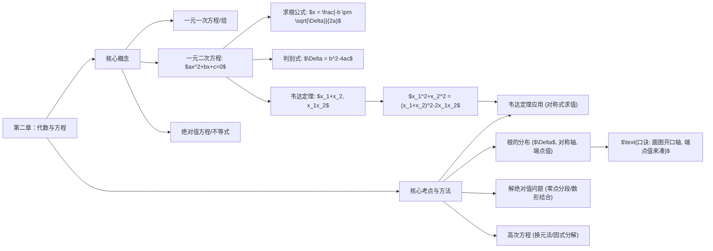

---
id:0019
status: not_started
subject: math
title: '"第二章：代数与方程"'
type: topic
---

好的，作为一位资深的考研与MEM备考专家，我为你呈上这份极具实战价值的《第二章：代数与方程》学习笔记。请收好，这不仅仅是知识点的罗列，更是解题思维的浓缩。

---

### 第一部分：核心定义（基础地基）

本章是整个管理类联考数学的基石，务必做到滚瓜烂熟。

1.  **一元二次方程**
    *   **标准形式：** $ax^2 + bx + c = 0$  (其中 $a \neq 0$)
    *   **求根公式：** $x = \frac{-b \pm \sqrt{b^2 - 4ac}}{2a}$
    *   **判别式 (Discriminant)：** $\Delta = b^2 - 4ac$
        *   $\Delta > 0 \iff$ 方程有两个**不相等**的实数根。
        *   $\Delta = 0 \iff$ 方程有两个**相等**的实数根。
        *   $\Delta < 0 \iff$ 方程**没有**实数根。
        *   ***易混点：*** 题目若说“方程有实数根”，则意味着 $\Delta \ge 0$，不要漏掉等号。

2.  **韦达定理 (Vieta's Formulas)**
    *   若 $x_1, x_2$ 是方程 $ax^2 + bx + c = 0$ 的两个根，则：
    *   **两根之和：** $x_1 + x_2 = -\frac{b}{a}$
    *   **两根之积：** $x_1 x_2 = \frac{c}{a}$

3.  **常用对称式/轮换式**
    *   这些是由韦达定理衍生出的，必须秒记，考试时没有时间给你推导：
    *   平方和：$x_1^2 + x_2^2 = (x_1 + x_2)^2 - 2x_1x_2$
    *   倒数和：$\frac{1}{x_1} + \frac{1}{x_2} = \frac{x_1 + x_2}{x_1x_2}$
    *   差的平方：$(x_1 - x_2)^2 = (x_1 + x_2)^2 - 4x_1x_2$
    *   绝对值差：$|x_1 - x_2| = \frac{\sqrt{\Delta}}{|a|}$

4.  **绝对值方程与不等式**
    *   **核心思想：** *零点分段法* 和 *数形结合法*。
    *   $|x| < a \iff -a < x < a$  (a > 0)
    *   $|x| > a \iff x > a \text{ 或 } x < -a$ (a > 0)

### 第二部分：核心考点（考试套路）

掌握了套路，才能以不变应万变。

#### 考点 1：韦达定理的“变形金刚”

*   **原理：** 不解方程，直接利用根与系数的关系求解关于根的代数式。
*   **秒杀结论：** 熟记第一部分中的“常用对称式”。凡是题目中给了一个方程，又问一个关于 $x_1, x_2$ 的对称表达式（即交换 $x_1, x_2$ 后表达式不变），99%都是考察韦达定理。
*   **应用场景：**
    1.  已知方程，求 $x_1^2 + x_2^2$ 的值。
    2.  已知方程两根满足某个关系式（如 $2x_1 + x_2 = 5$），反求方程中的参数。
    3.  构造以 $\frac{1}{x_1}, \frac{1}{x_2}$ 为根的新方程。

#### 考点 2：一元二次方程根的分布

*   **原理：** 通过“三个工具”——**判别式、对称轴、端点函数值**，确定含参二次方程的根在数轴上的位置范围。
*   **核心结论 (以 $a>0$，开口向上为例)：**
    *   **两根均大于 k：** $\begin{cases} \Delta \ge 0 \\ -\frac{b}{2a} > k \\ f(k) > 0 \end{cases}$
    *   **两根均小于 k：** $\begin{cases} \Delta \ge 0 \\ -\frac{b}{2a} < k \\ f(k) > 0 \end{cases}$
    *   **一根大于 k，一根小于 k：** $f(k) < 0$ (此时自动满足 $\Delta > 0$)
*   **应用场景：** 题目中出现“方程的根在区间 $(1, 3)$ 内”、“方程有正根和负根”等字眼时，立即启动根的分布分析框架。

### 第三部分：真题逻辑演练（文字解析）

**【例题 1】** (改编自真题) 若关于 $x$ 的方程 $x^2 - (k+1)x + k = 0$ 的两根之差的绝对值为 2，则实数 $k$ 的值为多少？

*   **文字解析：**
    1.  **识别考点：** 看到“两根之差的绝对值”，立刻联想到韦达定理的推论公式 $|x_1 - x_2| = \frac{\sqrt{\Delta}}{|a|}$。这是最高效的路径。
    2.  **套用公式：**
        *   首先，确定方程的系数：$a=1, b=-(k+1), c=k$。
        *   计算判别式 $\Delta = b^2 - 4ac = [-(k+1)]^2 - 4(1)(k) = k^2 + 2k + 1 - 4k = k^2 - 2k + 1 = (k-1)^2$。
        *   代入公式：$|x_1 - x_2| = \frac{\sqrt{(k-1)^2}}{|1|} = |k-1|$。
    3.  **求解结论：** 根据题意，我们有 $|k-1| = 2$。解这个绝对值方程得到 $k-1 = 2$ 或 $k-1 = -2$。因此，$k=3$ 或 $k=-1$。

**【例题 2】** (改编自真题) 已知关于 $x$ 的方程 $x^2 + 2(m-1)x + m^2 - 3 = 0$ 有两个不相等的实数根，且都小于 2。求实数 $m$ 的取值范围。

*   **文字解析：**
    1.  **识别考点：** “两个不等的实数根”、“都小于2”，这是典型的根的分布问题。
    2.  **搭建逻辑框架：** 需要同时满足三个条件才能保证两根都小于2 (画一个开口向上的抛物线，对称轴和两个根都在 $x=2$ 的左侧)：
        *   **条件一 (存在性)：** 方程有“两个不等的实数根”，意味着判别式 $\Delta > 0$。
        *   **条件二 (位置性)：** 两个根的“平均数”——也就是对称轴，必须在 2 的左边，即 $-\frac{b}{2a} < 2$。
        *   **条件三 (边界性)：** 当 $x=2$ 时，函数值 $f(2)$ 必须大于 0，否则图像会穿过 $x$ 轴，导致有一个根大于或等于 2。
    3.  **分步计算求解：**
        *   **解条件一：** $\Delta = [2(m-1)]^2 - 4(1)(m^2-3) = 4(m^2-2m+1) - 4m^2+12 = -8m + 16 > 0 \implies m < 2$。
        *   **解条件二：** 对称轴 $x = -\frac{2(m-1)}{2(1)} = -(m-1) = 1-m$。所以 $1-m < 2 \implies m > -1$。
        *   **解条件三：** 令 $f(x) = x^2 + 2(m-1)x + m^2 - 3$。$f(2) = 2^2 + 2(m-1)(2) + m^2 - 3 = 4 + 4m - 4 + m^2 - 3 = m^2 + 4m - 3 > 0$。解这个二次不等式，求根为 $m = \frac{-4 \pm \sqrt{16-4(-3)}}{2} = -2 \pm \sqrt{7}$。所以 $m > -2+\sqrt{7}$ 或 $m < -2-\sqrt{7}$。
    4.  **整合结论：** 将三个条件的解集取交集：$\{m|m<2\}$, $\{m|m>-1\}$, $\{m|m > -2+\sqrt{7} \text{ 或 } m < -2-\sqrt{7}\}$。
        *   由于 $\sqrt{4} < \sqrt{7} < \sqrt{9}$，所以 $2 < \sqrt{7} < 3$。
        *   $-2+\sqrt{7}$ 的值在 0 和 1 之间。
        *   $-2-\sqrt{7}$ 的值在 -5 和 -4 之间。
        *   画数轴取交集，最终得到 $m$ 的范围是 $(-2+\sqrt{7}, 2)$。

### 第四部分：避坑指南（考试心理）

1.  **陷阱：** 凡涉及二次项系数含参，必先讨论系数是否为0。
    *   **防坑口诀：** “二次项，带字母，先问自己是不是零。”
2.  **陷阱：** 题目只说“有根”，就默认是两个不等的根，从而 $\Delta > 0$。
    *   **防坑口诀：** “有实根，$\Delta \ge 0$；两异根，$\Delta > 0$。一字之差，谬以千里。”
3.  **陷阱：** 绝对值不等式 $|f(x)| > |g(x)|$ 直接去绝对值。
    *   **防坑口诀：** “两边皆正，平方再动；心中有数，几何图形。” (两边都是正数时，可以平方去掉绝对值，即 $f(x)^2 > g(x)^2$；或者利用数形结合思想，画图看距离。)

### 第五部分：考情分析（情报局）

*   **难度星级：** ⭐⭐⭐
*   **考频指数：** ⭐⭐⭐⭐⭐
*   **命题趋势：**
    *   **综合化：** 单纯考察解方程的题目几乎绝迹。本章知识点会作为“工具”，融入到函数、不等式、应用题等各类题目中。
    *   **参数化：** 越来越多的题目以含参方程或不等式的形式出现，考察考生的分类讨论和逻辑完备性。
    *   **应用化：** 结合企业利润、成本、增长率等实际场景，将问题建模为代数方程求解，考察你将商业问题转化为数学问题的能力。

### 第六部分：思维导图（知识网）

### 第七部分：针对 MEM/MBA 的复习建议

1.  **回归基础，不做偏题：** 对于在职考生，时间宝贵。本章的复习核心是牢牢掌握一元二次方程的“一根（求根公式）两理（判别式、韦达定理）”。不要在三次及以上方程的偏门技巧上浪费时间，管联大纲对此要求很低。
2.  **强化“翻译”能力：** 备考MEM/MBA，数学不仅是计算，更是商业语言。拿到一道应用题，要立刻训练自己将其“翻译”成数学模型。例如，看到“保本点”、“利润最大化”，就要想到令函数值为0或求顶点坐标，这些都离不开方程的知识。
3.  **例题驱动，总结模板：** 不要题海战术。把近5-10年的真题中涉及本章的题目吃透。每做完一道，不仅要看懂答案，更要思考这道题属于哪个“考点套路”（比如根的分布），然后把解题步骤模板化。这样在考场上才能快速反应，精准打击。
