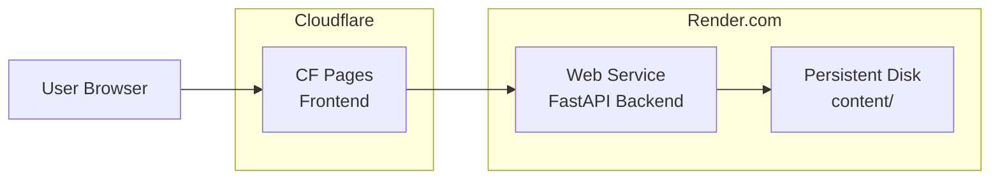

# Cloud Deployment Design Document

## Architecture Overview



- **Frontend**: Cloudflare Pages (free, unlimited requests)
- **Backend**: Render.com Web Service (free tier: 750 hours/month, with disk)
- **Data**: Markdown files persist on Render's disk (or Git-synced)

---

## Proposed Changes

### 1. Frontend Configuration (Cloudflare Pages)

#### [NEW] `web/.env.production`
```bash
VITE_API_BASE_URL=https://mem-study-api.onrender.com
```

#### [MODIFY] API Calls in Frontend
Replace all hardcoded `http://localhost:8000` with environment variable:
```javascript
const API_BASE = import.meta.env.VITE_API_BASE_URL || 'http://localhost:8000';
```

**Files to modify:**
- `web/src/views/VocabularyView.vue`
- `web/src/views/ContentView.vue`
- `web/src/components/VocabularyDetail.vue`

---

### 2. Backend Configuration (Render.com)

#### [NEW] `render.yaml`
```yaml
services:
  - type: web
    name: mem-study-api
    runtime: python
    buildCommand: pip install -r requirements.txt
    startCommand: uvicorn scripts.api:app --host 0.0.0.0 --port $PORT
    envVars:
      - key: PYTHON_VERSION
        value: "3.11"
    disk:
      name: content-data
      mountPath: /opt/render/project/src/content
      sizeGB: 1
```

#### [NEW] `requirements.txt`
```text
fastapi>=0.100.0
uvicorn[standard]>=0.23.0
pyyaml>=6.0
openai>=1.0.0
pypdfium2>=4.0.0
python-multipart>=0.0.6
```

#### [MODIFY] `scripts/api.py`
Update CORS to allow production domain:
```python
app.add_middleware(
    CORSMiddleware,
    allow_origins=[
        "http://localhost:5173",
        "https://hailang0616.xyz",  # Your CF Pages domain
    ],
    allow_credentials=True,
    allow_methods=["*"],
    allow_headers=["*"],
)
```

---

### 3. LLM Configuration

#### [NEW] `config/config.yaml.example`
```yaml
llm:
  api_key: "your-api-key-here"
  base_url: "https://api.openai.com/v1"
  model: "gpt-4o-mini"
```

> **IMPORTANT**: On Render, set `LLM_API_KEY` as an environment variable instead of using config file.

#### [MODIFY] `scripts/llm_analyzer.py`
Add environment variable fallback:
```python
import os

def load_config():
    # Try environment variables first (for cloud deployment)
    if os.environ.get("LLM_API_KEY"):
        return {
            "llm": {
                "api_key": os.environ.get("LLM_API_KEY"),
                "base_url": os.environ.get("LLM_BASE_URL", "https://api.openai.com/v1"),
                "model": os.environ.get("LLM_MODEL", "gpt-4o-mini")
            }
        }
    # Fall back to config file
    if CONFIG_PATH.exists():
        with open(CONFIG_PATH, "r", encoding="utf-8") as f:
            return yaml.safe_load(f)
    return {}
```

---

## Deployment Steps

### Frontend (Cloudflare Pages)
1. Push code to GitHub
2. Go to [Cloudflare Dashboard](https://dash.cloudflare.com) → Pages
3. Create project → Connect GitHub repo
4. Settings:
   - Build command: `npm run build`
   - Build output: `dist`
   - Root directory: `web`
5. Add environment variable: `VITE_API_BASE_URL`

### Backend (Render.com)
1. Push code to GitHub
2. Go to [Render Dashboard](https://dashboard.render.com)
3. New → Web Service → Connect GitHub repo
4. Settings:
   - Runtime: Python 3
   - Build: `pip install -r requirements.txt`
   - Start: `uvicorn scripts.api:app --host 0.0.0.0 --port $PORT`
5. Add disk (1GB, mount at `/opt/render/project/src/content`)
6. Add environment variables: `LLM_API_KEY`, `LLM_BASE_URL`, `LLM_MODEL`

---

## Verification Plan

### Smoke Tests
- [ ] Frontend loads on CF Pages domain
- [ ] API responds at Render URL
- [ ] CORS allows cross-origin requests
- [ ] Vocabulary CRUD works
- [ ] LLM generation works with env vars

### Data Persistence
- [ ] Create a new word → Restart Render service → Word still exists
