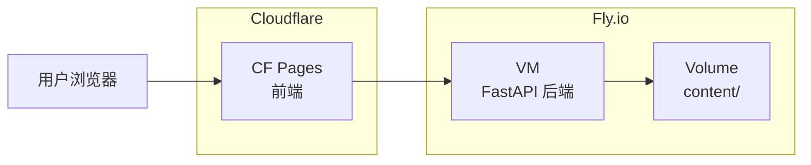

# 云端部署设计文档

## 架构概览



- **前端**：Cloudflare Pages（免费，无限请求）
- **后端**：Fly.io VM（免费层：3 个共享 VM，3GB 持久化存储）
- **数据**：Markdown 文件持久化存储在 Fly.io Volume 上

---

## 需要的改动

### 1. 前端配置（Cloudflare Pages）

#### [新增] `web/.env.production`
```bash
VITE_API_BASE_URL=https://mem-study-api.onrender.com
```

#### [修改] 前端 API 调用
将所有硬编码的 `http://localhost:8000` 替换为环境变量：
```javascript
const API_BASE = import.meta.env.VITE_API_BASE_URL || 'http://localhost:8000';
```

**需要修改的文件：**
- `web/src/views/VocabularyView.vue`
- `web/src/views/ContentView.vue`
- `web/src/components/VocabularyDetail.vue`

---

### 2. 后端配置（Fly.io）

#### [新增] `fly.toml`
```toml
app = "mem-study-api"
primary_region = "hkg"

[build]
  dockerfile = "Dockerfile"

[env]
  PORT = "8080"

[http_service]
  internal_port = 8080
  force_https = true
  auto_stop_machines = true
  auto_start_machines = true

[[mounts]]
  source = "content_data"
  destination = "/app/content"

[[vm]]
  cpu_kind = "shared"
  cpus = 1
  memory_mb = 256
```

#### [新增] `Dockerfile`
```dockerfile
FROM python:3.11-slim
WORKDIR /app
COPY requirements.txt .
RUN pip install --no-cache-dir -r requirements.txt
COPY scripts/ ./scripts/
COPY config/ ./config/
RUN mkdir -p /app/content
EXPOSE 8080
CMD ["uvicorn", "scripts.api:app", "--host", "0.0.0.0", "--port", "8080"]
```

#### [新增] `requirements.txt`
```text
fastapi>=0.100.0
uvicorn[standard]>=0.23.0
pyyaml>=6.0
openai>=1.0.0
pypdfium2>=4.0.0
python-multipart>=0.0.6
```

#### [修改] `scripts/api.py`
更新 CORS 配置以允许生产域名：
```python
app.add_middleware(
    CORSMiddleware,
    allow_origins=[
        "http://localhost:5173",
        "https://hailang0616.xyz",  # 你的 CF Pages 域名
    ],
    allow_credentials=True,
    allow_methods=["*"],
    allow_headers=["*"],
)
```

---

### 3. LLM 配置

#### [新增] `config/config.yaml.example`
```yaml
llm:
  api_key: "your-api-key-here"
  base_url: "https://api.openai.com/v1"
  model: "gpt-4o-mini"
```

> **重要提示**：在 Fly.io 上部署时，请使用 `fly secrets set` 设置环境变量。

#### [修改] `scripts/llm_analyzer.py`
添加环境变量回退机制：
```python
import os

def load_config():
    # 优先使用环境变量（云端部署）
    if os.environ.get("LLM_API_KEY"):
        return {
            "llm": {
                "api_key": os.environ.get("LLM_API_KEY"),
                "base_url": os.environ.get("LLM_BASE_URL", "https://api.openai.com/v1"),
                "model": os.environ.get("LLM_MODEL", "gpt-4o-mini")
            }
        }
    # 回退到本地配置文件
    if CONFIG_PATH.exists():
        with open(CONFIG_PATH, "r", encoding="utf-8") as f:
            return yaml.safe_load(f)
    return {}
```

---

## 部署步骤

### 前端（Cloudflare Pages）
1. 将代码推送到 GitHub
2. 进入 [Cloudflare 控制台](https://dash.cloudflare.com) → Pages
3. 创建项目 → 连接 GitHub 仓库
4. 配置：
   - 构建命令：`npm run build`
   - 输出目录：`dist`
   - 根目录：`web`
5. 添加环境变量：`VITE_API_BASE_URL`

### 后端（Fly.io）

```bash
# 1. 安装 flyctl CLI
# Windows: winget install flyctl
# Mac: brew install flyctl

# 2. 登录 Fly.io
fly auth login

# 3. 创建应用（首次运行）
fly launch --name mem-study-api --region hkg --no-deploy

# 4. 创建持久化卷（3GB 免费）
fly volumes create content_data --region hkg --size 1

# 5. 设置环境变量
fly secrets set LLM_API_KEY=your-api-key-here
fly secrets set LLM_BASE_URL=https://api.openai.com/v1
fly secrets set LLM_MODEL=gpt-4o-mini

# 6. 部署
fly deploy

# 7. 上传初始内容（可选）
# 需要 SSH 到容器或使用 fly sftp
```

---

## 验证计划

### 冒烟测试
- [ ] 前端在 CF Pages 域名上正常加载
- [ ] API 在 Fly URL 上正常响应
- [ ] CORS 允许跨域请求
- [ ] 单词增删改查功能正常
- [ ] LLM 生成功能正常（使用环境变量）

### 数据持久化
- [ ] 创建新单词 → 重启 Fly 服务 → 单词仍然存在

---

## 本地开发兼容性

所有改动都采用**向后兼容**设计：

| 场景 | 行为 |
|------|------|
| 本地开发（无环境变量） | 自动使用 `localhost:8000` 和本地 `config.yaml` |
| 云端部署（有环境变量） | 自动使用生产配置 |

**不会影响现有的本地开发流程。**
